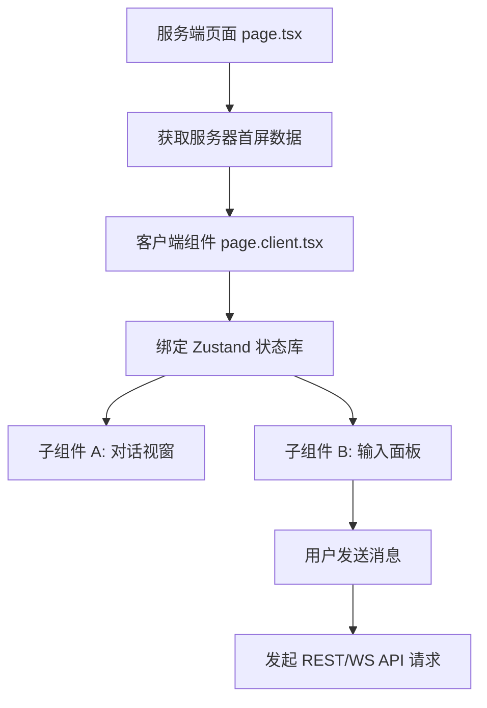

# Skill: Web Feature Document Protocol (前端模块说明规范)

## 核心原则 / Core Principle
本规范旨在指导 AI 智能体与开发者为**前端（Next.js App Router）**的每个核心页面与模块撰写统一、精准的 `Agent.md` 指南。修改该页面的逻辑或优化 UI 时，AI 能够快速还原组件层次、页面跳转以及状态管理流向。**本规范强制要求包含描述页面生命周期、组件树或用户交互流向的 Mermaid 流程图**。

---

## 前端 `Agent.md` 规范模板 / Frontend Template

```markdown
# Frontend Module: [功能页面名称 / Page Name]

## 1. 业务场景概述 / Page Overview
- **页面功能**: 简述本页面提供给用户什么功能（如：展示历史记录、查看测评报告、扫码登录）。
- **用户交互流程**: 描述用户在此页面上的典型交互动作。

## 2. 页面渲染与交互流程图 / UI & Interaction Workflows (Mermaid)
此处必须提供描述组件生命周期、状态流或组件层次结构的 Mermaid 流程图。例如：



## 3. 页面结构与组件划分 / Layout & Components
- **服务端组件 (Server Component)**: 入口 `page.tsx` 负责的事情（如 SEO Title 配置、从服务端加载首屏数据）。
- **客户端组件 (Client Component)**: `page.client.tsx` 的布局、状态以及核心交互组件。
- **自定义 UI 组件**: 模块中使用的关键子组件（如 `components/ui/` 中的对话泡泡、评分图表等）。
- **组件层次结构**:
  - `page.tsx` (SEO + Data Fetching)
    └── `page.client.tsx` (Zustand store link + Layout)
         ├── `ChatWindow.tsx` (聊天框)
         └── `ControlPanel.tsx` (控制板)

## 4. 状态管理与数据流 / State Management & Data Flow
- **全局/本地状态**: 使用了哪些 Zustand Store（如 `useUserStore`）或者 React State。
- **API 请求路由**: 页面与后端通信的 API 路径（如 `src/api/interview.ts`）。
- **数据流向 / Data Flow**:
  1. 用户触发交互事件（如发送行动指令）
  2. 触发本地处理函数，调用 Zustand actions
  3. 通过 API 工具向后端发送 HTTP 或 WebSocket 请求
  4. 收到响应，更新 Zustand store 状态
  5. React 重新渲染组件界面，展示更新。

## 5. UI 风格与交互约束 / UI Styles & Interaction Constraints
- **Tailwind/CSS 风格**: 特殊的样式设计与布局约束（如：全屏毛玻璃效果、移动端自适应折叠、绝对定位悬浮框）。
- **动效与交互反馈**: 按钮加载态 (Loading)、过渡动画的触发逻辑与实现方式。

## 6. 调试与验证方法 / Debugging & Verification
- **开发调试方法**: 如何在本地模拟不同的 UI 状态（如：通过 mock 数据测试没有面试历史时的“空状态”界面）。
- **浏览器调试要点**: 在 Chrome DevTools 中，需要监控哪些网络请求 (Network) 或控制台警告。
```

---

## AI 智能体编写守则 / Guidelines for AI Agents
1. **强制画图**：每个前端页面 `Agent.md` **必须**包含至少一个描述 UI 挂载、组件树或状态流向的 Mermaid 流程图。
2. **真实架构还原**：编写前端 `Agent.md` 时，必须结合 `src/` 的真实文件命名与结构，如实还原组件引用关系。
3. **保持更新**：当页面路由、状态管理逻辑或核心组件结构发生变动时，必须同步更新该模块的 `Agent.md`。
