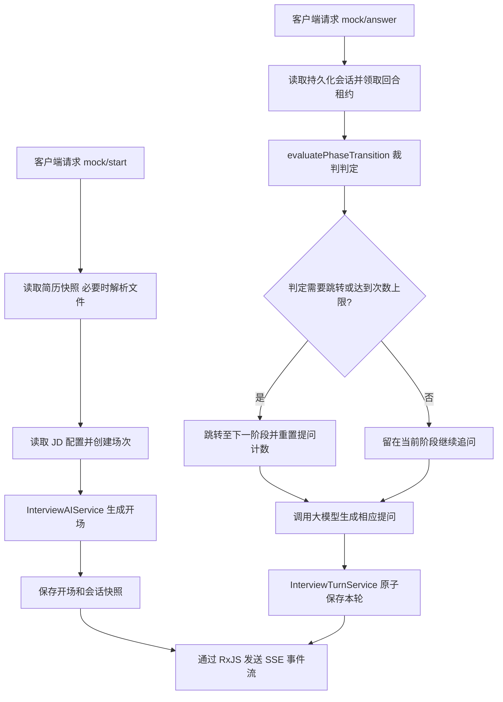
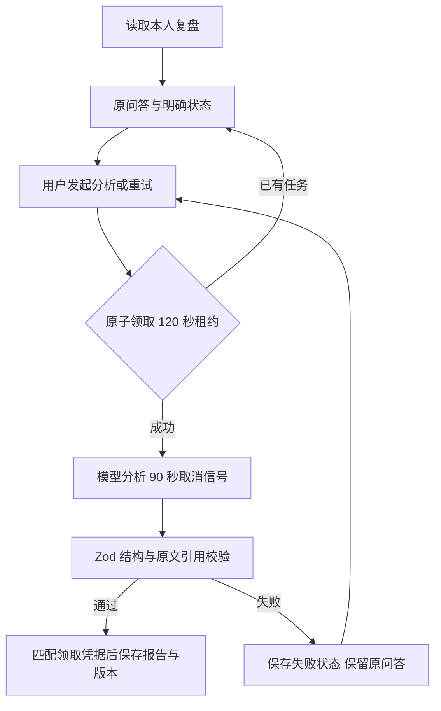
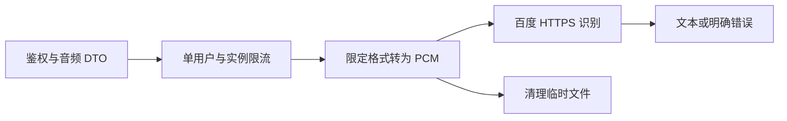
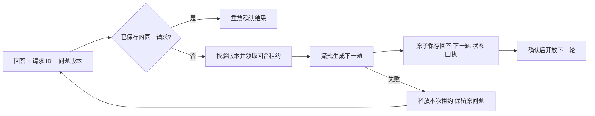
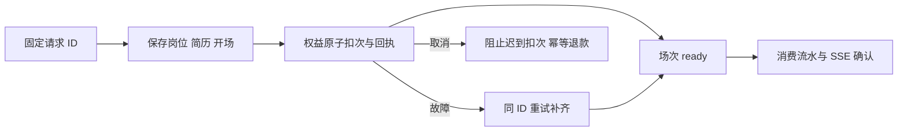

# Backend Module: AI Interview & Evaluation System (AI 面试与测评系统)

## 1. 业务功能概述 / Business Functionality
- **核心业务逻辑**: 本模块是整个平台的核心，为用户提供智能简历分析、简历高频提问预测（简历押题）、流式 AI 模拟面试（包含专项技术面试、综合面试）以及生成最终的面试能力评估报告。
- **用户故事**: 
  1. 用户上传简历，请求“简历分析”或触发“简历押题”
  2. 开启模拟面试（支持选择不同岗位、JD），通过服务端发送的 SSE (Server-Sent Events) 流式获取面试官提问。
  3. 用户提交回答，AI 面试官根据前置的状态路由决策流转，继续生成追问或判题。
  4. 面试结束，AI 进行全局打分，生成多维度的评估报告。

## 2. 核心业务流程图 / Core Business Workflows (Mermaid)

## 3. 架构设计与代码流转 / Architectural Workflow
- **控制器 (InterviewController)**:
  - 文件：`interview.controller.ts`
  - 核心接口（控制器统一受 `JwtAuthGuard` 保护，继续对话另校验会话归属）：
    - `POST /interview/analyze-resume`: 分析简历内容。
    - `POST /interview/resume/quiz/stream`: 简历押题流式接口（SSE）。
    - `POST /interview/mock/start`: 启动模拟面试流式提问。
    - `POST /interview/mock/answer`: 用户提交回答，获取下一题流式响应。
    - `GET /interview/analysis/report/:resultId`: 获取打分报告。
- **核心业务服务 (InterviewService)**:
  - 文件：`services/interview.service.ts`
  - 职责：编排开场、简历押题和权益入口；模拟回合委托 InterviewTurnService，复盘委托 InterviewReportService。语音识别由独立 InterviewSpeechService 提供。
- **大模型核心处理服务 (InterviewAIService)**:
  - 文件：`services/interview-ai.service.ts`
  - 职责：直接负责与大模型（通过 LangChain/OpenAI）交互。编写核心 Prompt 规则（押题、简历深挖、技术评估），解析并构建符合 JSON schemas 的输出结构。
- **文档文本抽取 (DocumentParserService)**:
  - 文件：`services/document-parser.service.ts`
  - 职责：利用 `pdf-parse` 和 `mammoth` 抽取上传简历文件 (PDF/Docx) 的原始文本。
- **核心数据流向 / Data Flow**:
  1. 客户端请求 `mock/start`，传入 `resumeId` 等参数。
  2. `InterviewService` 调用 `DocumentParserService` 读取简历文件并提取纯文本。
  3. 通过 `InterviewAIService` 引导大模型输出第一条面试官提问，以 EventStream (SSE) 格式写回客户端。
  4. 客户端发起 `mock/answer` 提交用户的回答。
  5. 重新载入历史对话，由 LLM 进行语义流转决策并生成追问，流式返回客户端。

## 4. 技术依赖与第三方 API / Tech Stack & External APIs
- **核心库**: `pdf-parse` (PDF解析), `mammoth` (Word解析), `@langchain/core`, `rxjs` (用于 SSE 进度流推送管理)
- **大模型支持**: 结合 LangChain 进行模型调用，通过 `StructuredOutputParser` 进行结果 Schema 定义。

## 5. 开发约束与边界处理 / Constraints & Guidelines
- **SSE 流传输约束**: 在所有流式输出接口（如 `mock/start`、`mock/answer`）中，**必须**显式设定响应 Header (如 `Content-Type: text/event-stream; charset=utf-8`，`Cache-Control: no-cache`，禁用 Nginx 缓冲等)。
- **订阅释放**: 在 SSE 请求中，客户端意外关闭连接（`res.on('close')`）时，**必须**主动取消 RxJS 的 `Subscription` 订阅，以防止发生服务器后台线程泄露。
- **判分逻辑**: 押题分析与实际回答评估分开。模拟面试未观测的维度不能强凑分数，报告必须区分生成状态与面试状态；新生成反馈引用本场回答原文。

## 6. 本地调试与排查 / Debugging & Verification
- **流式调试**: 建议使用 `curl` 命令行直接调试流式响应，例如：
  `curl -N -X POST -H "Authorization: Bearer <token>" -H "Content-Type: application/json" -d '{"position":"前端"}' http://localhost:3000/interview/mock/start`
- **日志关键字**: 
  - `[InterviewService] startMockInterviewWithStream` (面试开始)
  - `[DocumentParserService] Finished parsing file` (解析文件完成)
  - 异常排查关注大模型调用的 API Timeouts。

## 第一阶段可靠性修复

- 简历押题的缓存命中和新结果统一由流式入口发送 `yati-complete` 并结束；失败事件携带可显示的错误消息。
- 仅在本次确实扣次后执行失败退款；兑换在同一个条件更新中校验余额并增加次数。跨请求幂等与跨文档账务恢复尚在重构范围内，不能将这一局部修复等同于完整账务保障。
- 模拟面试回答已迁移到持久化回合服务；恢复、并发和重试边界见下方「持久化回合与恢复」。
- 新场次可选择热身 / 标准 / 挑战，对应 15 / 30 / 45 分钟和最多 6 / 12 / 18 次作答；每阶段追问上限为 1 / 2 / 3。回答达到时长或次数上限时先保存最后回答再结束，报告仍由用户主动生成。旧场次保留原来的 targetDuration 与阶段数据，不自动缩短。开场自我介绍之后直接进入专业经历或 HR 行为阶段，避免再问一次自我介绍；岗位题目不固定为 JavaScript 编程。
- SSE 订阅在响应关闭时清理；取消订阅不等于底层模型调用已取消。Node 请求对象的 close 表示请求读取结束，不能用它判断整个响应已断开（[Node HTTP 文档](https://nodejs.org/api/http.html#event-close_3)）。

- 文件解析仅允许当前配置 OSS Bucket 内本人的简历目录，由 `StsService` 重新生成短期读取签名；不追随重定向。文本清理保留英文单词空格和段落，避免破坏内容。

## 复盘服务与任务恢复

`InterviewReportService` 已从面试编排中抽取，负责模拟面试复盘读取、任务领取、生成和失败恢复。它复用 `InterviewAIService` 与现有模型工厂，不是新增 Agent 或 Jev 接入。

- `GET /interview/mock/review/:resultId`：只读本人原问答、分析和状态；不会调用模型。
- `POST /interview/mock/review/:resultId/generate`：面试结束后由用户发起生成/重试；不扣练习次数，但会调用已配置模型。
- 状态为 `not_ready/pending/generating/completed/failed/insufficient_data`。无有效回答时返回信息不足，不生成默认低分。生成失败仍可回看问答；不存在或非本人记录为 404。
- 旧 `/interview/analysis/report/:resultId` 保留押题分析，以及已完成模拟报告的字段适配；改为只读，不再在 GET 中自动生成/重试。应配套发布新版复盘页，旧前端无法通过轮询启动待生成报告。

- 单场最多 3 次尝试，领取在同一文档中条件更新。旧无租约的 generating 记录及过期任务视为可恢复；用户再次发起时领取，不在启动时批量迁移，也没有后台扫描队列。
- 保存成功/失败都匹配 `reportLeaseToken`，防止旧任务覆盖重试结果。取消信号不保证供应商立即停算，过期恢复也不承诺模型费用严格一次；持久化结果有写入隔离。
- `assessment-output.ts` 的 `interview-evidence-v1` 规定分数可空、范围校验、反馈问题序号和连续原文引用；引用必须存在于对应回答。文本不能判断真实语音流畅度，fluencyScore 强制为 null。模型输出缺失字段直接失败，不再补 75/80 分。
- `reportEvidence/reportRubricVersion` 只在新报告生成后保存；历史记录无证据就显示缺失，不批量重生成或伪造。原文存在只能验证引用真实性，不代表已经验证评价语义与评分质量。
- 接口只返回复盘所需字段，不返回 sessionState、简历快照、任务领取凭据和供应商原始错误。
- 单元测试见 `test/interview/interview-report.spec.ts`；真实数据库并发/租约测试见 `test/integration/report-recovery.cjs`（AI Stub）；真实 HTTP 只读状态验证见 `report-http.cjs`。模型实际质量尚需独立评估。

## 历史记录分页

三个历史入口接收 `InterviewHistoryQueryDto`：page 默认 1、范围 1–100000；limit 默认 10、范围 1–50，必须为整数。返回 `{ list, total, page, limit }`；查询与计数都限定当前用户和面试类型，按 `createdAt desc, _id desc` 排序。分页请求不是数据库快照，新插入记录可能移动跨页位置；本次不引入游标迁移。

模拟面试列表复用 `InterviewReportService.status` 判断复盘状态，返回字段白名单，不透出问答、简历和内部租约；押题记录已落库即显示完成。现有前端支持 list 包装，新前端同时兼容旧服务端全量数组。无查询参数也返回默认第一页，不再返回无界列表；外部脚本如直接依赖数组，需改读 data.list 并按 total 分页。无需回填历史记录。

## 语音服务边界

`POST /interview/speech-to-text` 由 `InterviewSpeechService` 编排，`AudioTranscoderService` 使用随包 ffmpeg，`BaiduSpeechService` 管理 HTTPS Token 与识别请求；不再放在面试主服务中。请求保留 `{ audio: Base64 }`，返回 `{ text }`。

- Base64 解码前后检查，文件最大 4 MB；仅 WebM、Ogg、M4A/MP4、WAV 容器。禁止播放列表及网络协议输入；格式识别不代替 ffmpeg 解码有效性检查。
- 转为 16kHz、单声道、16-bit PCM；按解码后的字节数拒绝超过 60 秒音频，不截断后冒充完整答案。ffmpeg 最长 8 秒、输出有上限，超时杀进程并等待退出；各路径清理独立临时目录。
- 同用户一次一个请求、每分钟最多 8 次；每个服务进程最多 4 个并发。限流为内存级，重启会重置，多实例需在网关或共享存储增加总量限制，不声称已具备集群配额。
- `BAIDU_API_KEY` 与 `BAIDU_SECRET_KEY` 缺失返回 503；不再依赖 SDK 的 APP_ID 参数。Token 获取超时 5 秒、识别超时 12 秒，均禁止重定向，不自动重试付费识别。
- 400 为无效录音，422 为无清晰语音，429 为用户限流，502/503/504 为上游异常、不可用或超时。浏览器保留录音与文字并提供重试。只返回经过映射的错误，不返回原始上游消息、凭据、音频或临时路径。
- `test/integration/speech-http.cjs` 以真实 Controller/JWT/DTO/ffmpeg 和 Stub 供应商验证四种编码、超长、损坏、字段注入及临时清理；`speech-local.spec.ts` 额外验证浏览器真实录音经 Next 代理到转码。实际百度识别质量另行验收。

## 持久化回合与恢复

`InterviewTurnService` 接管回答、暂停、恢复和结束；`InterviewService` 保留创建场次委托与旧功能入口，不再使用模拟面试内存 Map。

- `POST mock/answer` 必须携带 UUID v4 `requestId` 和整数 `expectedVersion`。初始问题版本为 0，成功确认事件含 `questionVersion`。同一回答重试复用 ID；同 ID 更换文字或版本拒绝。只保存最近一轮重放回执，更早的重试由版本检查拒绝，不承诺无限历史回执。
- 所有查询限定用户；120 秒租约、90 秒生成超时，领取与提交均匹配版本。提交还匹配租约凭据及未过期时间，过期旧任务不能覆盖新任务。回答、下一题、Agent 状态与回执在同一 Mongo 文档更新；`waiting/end` 仅在保存成功后发送。模型失败和数据库失败不先增加题数；Agent 图异常不再冒充完整输出。
- 取消 SSE 订阅不会取消模型费用。生成超时后的迟到内容不再发送或写入，但当前图调用尚未完整贯通供应商取消信号；租约超时允许用户重试，不表示模型计费严格一次。
- `POST mock/resume/:resultId` 同时支持进行中场次、暂停场次和已完成场次的只读恢复；返回问答白名单、问题版本、最近确认请求 ID 及忙碌截止时间，不返回简历快照和租约凭据。暂停恢复调整开始时间以排除暂停时段。暂停、结束均拒绝与活跃回合争抢状态，重复暂停/结束可安全重试。
- `interview-session.ts` 校验 Mixed 快照并恢复 Date；兼容历史可选字段的 null。旧无版本记录从已保存题数建立首个版本，无批量回填。已有问答与快照不一致时明确拒绝，不擅自拼接或覆盖用户记录。
- 超时结束也保存最后一条回答，供复盘引用；主动结束不伪造新的问答。开场创建与扣次恢复由下述 `InterviewStartService` 处理。
- 部署需先停止旧后端实例，再发布新后端与新前端，避免旧实现绕过版本条件写入。旧客户端缺少字段会得到 400，需刷新并恢复场次；不可将新前端接到旧回答服务后重试。尚未实际部署。

验证入口：`test/interview/interview-turn.spec.ts`、`test/interview/interview-agent.spec.ts` 和独立数据库的 `test/integration/turn-recovery.cjs`。后者使用真实 JWT/DTO/HTTP/SSE/Mongo 与模型 Stub，验证并发、重放、服务实例重建、过期租约、暂停/结束竞争、失败重试及最后一条回答。模型内容质量另行验收。

## 开场确认与扣次恢复

- `POST mock/start` 要求 UUID v4 `requestId`、面试类型及非空岗位；同 ID 不可更换参数，重试读取持久化结果。简历可选；开场仍为本地模板，无模型调用。
- `InterviewStartService` 管理 prepared → ready 或 refunding → cancelled。准备与确认由 120 秒租约隔离；ready 前禁止回答、恢复、暂停和结束。旧记录无 startStatus 时沿用原兼容路径，无批量回填。
- 扣次前完成简历解析和开场快照；扣次后数据库错误保留同 ID 恢复。取消使用 `POST mock/start/:requestId/cancel`，body 与原开始请求一致；活跃准备任务需等待租约释放，已经 ready 的场次不会退款。
- 取消可先于原开始请求到达：保存取消记录拦截迟到请求。补偿调用可重复；消费流水按 resultId 覆盖修复。取消与准备状态均持久化，当前由用户重试恢复，没有后台扫描任务。
- 新前后端须配套发布；旧开始请求缺少 requestId 返回 400，刷新页面后使用新协议。测试 `start-recovery.cjs` 仅使用专用本地 Mongo 和合成账户，不调用付费供应商。

### 从练习记录取消未完成开场

`POST mock/start-result/:resultId/cancel` 仅查询当前用户已有场次，使用同一取消/补偿流程，不依赖浏览器原始请求和简历输入。缺失或其他用户记录返回 404；旧记录没有 startStatus/requestId 时拒绝退款；已 ready 返回 ready，让用户继续原场次；prepared 有活跃租约时返回 409；refunding/cancelled 可重复核对，不能重复退还。

模拟面试历史列表额外返回可选 startStatus，旧记录保持原结构；不返回请求摘要、简历快照、任务凭据。该入口为用户主动恢复，不意味着后台自动扫描。
