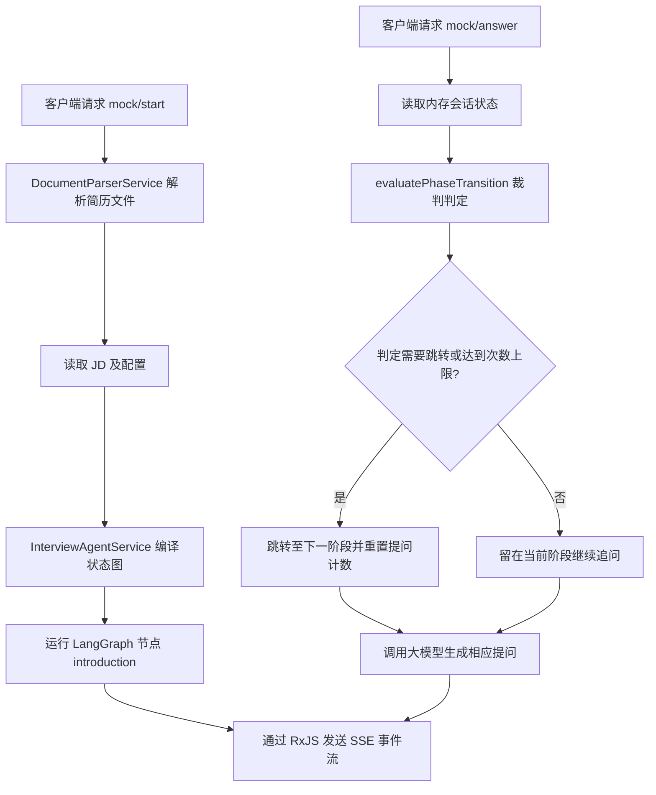

# Backend Module: AI Interview & Evaluation System (AI 面试与测评系统)

## 1. 业务功能概述 / Business Functionality
- **核心业务逻辑**: 本模块是整个平台的核心，为用户提供智能简历分析、简历高频提问预测（简历押题）、流式 AI 模拟面试（包含专项技术面试、综合面试）以及生成最终的面试能力评估报告。
- **用户故事**: 
  1. 用户上传简历，请求“简历分析”或触发“简历押题”
  2. 开启模拟面试（支持选择不同岗位、JD），通过服务端发送的 SSE (Server-Sent Events) 流式获取面试官提问。
  3. 用户提交回答，AI 面试官根据前置的状态路由决策流转，继续生成追问或判题。
  4. 面试结束，AI 进行全局打分，生成多维度的评估报告。

## 2. 核心业务流程图 / Core Business Workflows (Mermaid)

## 3. 架构设计与代码流转 / Architectural Workflow
- **控制器 (InterviewController)**:
  - 文件：`interview.controller.ts`
  - 核心接口（控制器统一受 `JwtAuthGuard` 保护，继续对话另校验会话归属）：
    - `POST /interview/analyze-resume`: 分析简历内容。
    - `POST /interview/resume/quiz/stream`: 简历押题流式接口（SSE）。
    - `POST /interview/mock/start`: 启动模拟面试流式提问。
    - `POST /interview/mock/answer`: 用户提交回答，获取下一题流式响应。
    - `GET /interview/analysis/report/:resultId`: 获取打分报告。
- **核心业务服务 (InterviewService)**:
  - 文件：`services/interview.service.ts`
  - 职责：编排业务流转，包括调用数据库保存面经结果、创建进度监控订阅器（通过 RxJS Subject 实现 SSE 管道）、积分扣减、文字转语音/语音转文字集成等。
- **大模型核心处理服务 (InterviewAIService)**:
  - 文件：`services/interview-ai.service.ts`
  - 职责：直接负责与大模型（通过 LangChain/OpenAI）交互。编写核心 Prompt 规则（押题、简历深挖、技术评估），解析并构建符合 JSON schemas 的输出结构。
- **文档文本抽取 (DocumentParserService)**:
  - 文件：`services/document-parser.service.ts`
  - 职责：利用 `pdf-parse` 和 `mammoth` 抽取上传简历文件 (PDF/Docx) 的原始文本。
- **核心数据流向 / Data Flow**:
  1. 客户端请求 `mock/start`，传入 `resumeId` 等参数。
  2. `InterviewService` 调用 `DocumentParserService` 读取简历文件并提取纯文本。
  3. 通过 `InterviewAIService` 引导大模型输出第一条面试官提问，以 EventStream (SSE) 格式写回客户端。
  4. 客户端发起 `mock/answer` 提交用户的回答。
  5. 重新载入历史对话，由 LLM 进行语义流转决策并生成追问，流式返回客户端。

## 4. 技术依赖与第三方 API / Tech Stack & External APIs
- **核心库**: `pdf-parse` (PDF解析), `mammoth` (Word解析), `@langchain/core`, `rxjs` (用于 SSE 进度流推送管理)
- **大模型支持**: 结合 LangChain 进行模型调用，通过 `StructuredOutputParser` 进行结果 Schema 定义。

## 5. 开发约束与边界处理 / Constraints & Guidelines
- **SSE 流传输约束**: 在所有流式输出接口（如 `mock/start`、`mock/answer`）中，**必须**显式设定响应 Header (如 `Content-Type: text/event-stream; charset=utf-8`，`Cache-Control: no-cache`，禁用 Nginx 缓冲等)。
- **订阅释放**: 在 SSE 请求中，客户端意外关闭连接（`res.on('close')`）时，**必须**主动取消 RxJS 的 `Subscription` 订阅，以防止发生服务器后台线程泄露。
- **判分逻辑**: 最终判分必须覆盖 matchedSkills (匹配技能点) 和 missingSkills (缺失技能点)，确保前台雷达图能获取到完整的数据。

## 6. 本地调试与排查 / Debugging & Verification
- **流式调试**: 建议使用 `curl` 命令行直接调试流式响应，例如：
  `curl -N -X POST -H "Authorization: Bearer <token>" -H "Content-Type: application/json" -d '{"position":"前端"}' http://localhost:3000/interview/mock/start`
- **日志关键字**: 
  - `[InterviewService] startMockInterviewWithStream` (面试开始)
  - `[DocumentParserService] Finished parsing file` (解析文件完成)
  - 异常排查关注大模型调用的 API Timeouts。

## 第一阶段可靠性修复

- 简历押题的缓存命中和新结果统一由流式入口发送 `yati-complete` 并结束；失败事件携带可显示的错误消息。
- 仅在本次确实扣次后执行失败退款；兑换在同一个条件更新中校验余额并增加次数。跨请求幂等与跨文档账务恢复尚在重构范围内，不能将这一局部修复等同于完整账务保障。
- 当前活跃模拟面试仍依赖内存 Map，暂停后可通过已有恢复接口重建；进程重启恢复需要后续完善。
- SSE 订阅在响应关闭时清理；取消订阅不等于底层模型调用已取消。Node 请求对象的 close 表示请求读取结束，不能用它判断整个响应已断开（[Node HTTP 文档](https://nodejs.org/api/http.html#event-close_3)）。

- 文件解析仅允许当前配置 OSS Bucket 内本人的简历目录，由 `StsService` 重新生成短期读取签名；不追随重定向。文本清理保留英文单词空格和段落，避免破坏内容。
