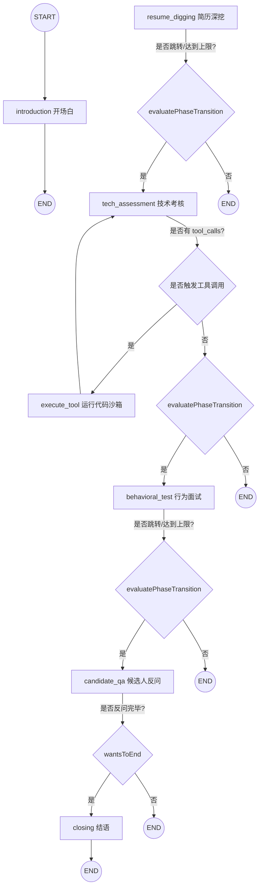

# Backend Agent Execution Workflow (面试智能体执行与状态流转设计)

本文档记录了面试智能体服务 `InterviewAgentService` 在后端的核心执行路径、工具链调用循环、多角色面板分工以及上下文重置（Context Resets）的具体实现逻辑。

---

## 1. 核心状态图拓扑 (LangGraph Topology)

面试过程使用 `LangGraph.js` 进行显示流转，整个面试流程共划分了 6 个核心面试节点与 1 个工具执行节点：

---

## 2. 详细执行与数据流向步骤 (Step-by-Step Execution)

当客户端发起 `/interview/mock/answer` 或 `/interview/mock/start` 时，后端执行链条如下：

1. **接口入口**：
   - 客户端请求经 `InterviewController` 到达 `InterviewService`。
   - `InterviewService` 调用 `InterviewAgentService.generateInterviewQuestionStream(context)` 启动异步生成器。
2. **上下文垃圾回收 (Context Resets / 40% Smart Zone 维护)**：
   - 在构建 LangGraph 输入前，检查历史消息数：
     - 若 `messages.length > 15`，触发重置机制。
     - 截取最后 4 条消息（最近 2 轮对话）作为 `activeContext`。
     - 将前面截断的消息格式化为文本，异步调用 LLM 进行摘要提取（`summarizeConversation`）。
     - 构造一条 `SystemMessage`（`[此前对话内容摘要]: ...`）置于头部，与 `activeContext` 拼接为新的消息数组。
     - **收益**：限制进入大模型的历史消息数在 5 条左右，维持在 40% Token 黄金推理区间，彻底消除由于历史过长导致的幻觉和复读（Dumb Zone）。
3. **图的实例化与运行**：
   - 将重置后的 `messages` 数组及状态变量注入 `stateInput`。
   - 实例化并运行编译好的 `StateGraph` 工作流。
4. **专家面板角色切换 (Multi-Agent Panel Switch)**：
   - **技术官“李工” (Tech Persona)**：
     - 激活于 `introduction`、`resume_digging`、`tech_assessment` 节点。
     - 提示词要求：以极其严谨、犀利、专业的语气追问底层原理与具体数据，手写算法必须审查边界隐患。
   - **HR 负责人“Lisa 老师” (HR Persona)**：
     - 激活于 `behavioral_test`、`candidate_qa`、`closing` 节点。
     - 提示词要求：温和耐心地考察 STAR 行为模型、沟通冲突和文化契合度。
     - 在进入 `behavioral_test` 节点时，自动前置自然的过渡语。
5. **代码沙箱工具循环 (Code Sandbox Tool Loop)**：
   - 当候选人提交带有代码块的回答时，`tech_assessment` 节点中的大模型会识别并触发 `run_javascript_code` 工具调用。
   - 图流转到 `execute_tool` 节点：
     - 调用 `createCodeSandboxTool`。
     - 写入临时文件，子进程执行 `node <temp_file>`。
     - 超时限制（2000ms）或缓冲区溢出（100KB）会自动熔断，删除临时文件并返回 JSON（含 `success`, `stdout`, `stderr`）。
     - 将结果封装成 `ToolMessage` 写入状态。
     - 强制路由回 `tech_assessment`，由大模型基于运行报错（如 `ReferenceError` 或 `Timeout`）生成追问。
6. **流式写回与状态落库**：
   - 对话输出通过 `onChunkToken` 回调由 RxJS Subject 管道流式发送回前端。
   - 对话结束后，LangGraph 返回最新的 `currentPhase`、`questionsAskedCount` 和识别出的技能，落库保存。
