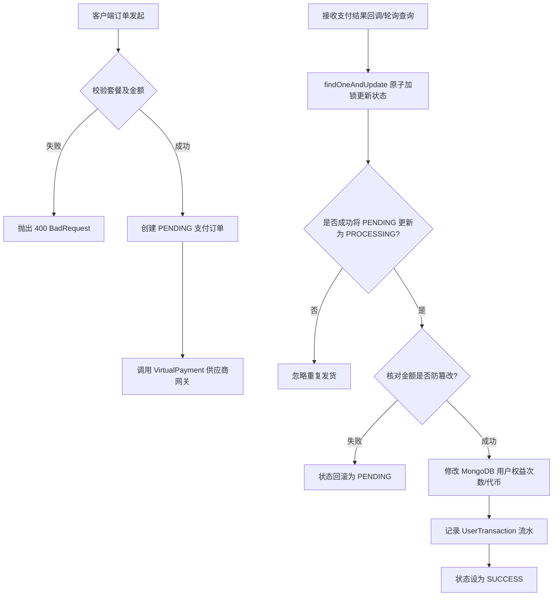

# Backend Module: Payment Integration & Benefits (支付对接与权益系统)

## 1. 业务功能概述 / Business Functionality
- **核心业务逻辑**: 处理充值订单发起、调用虚拟/微信/支付宝网关、支付状态同步查询、支付成功的回调处理，以及为用户累加对应的套餐权益（小麦币、单次技术面试包、无限次高级面试包等）。
- **用户故事 / 核心流程**:
  1. 用户在前端选择购买一个套餐（如 "Pro" 套餐，18.8 元）。
  2. 客户端请求后端发起支付，后端生成订单 ID 及订单记录落库，调用支付网关。
  3. 用户进行支付。支付完成后，后端通过主动轮询或网关异步回调收到交易成功通知。
  4. 后端进行状态幂等校验与金额审核，通过后为用户账户增量累加权益，并在流水表中记录一条 `RECHARGE` 类型记录。

## 2. 核心业务流程图 / Core Business Workflows (Mermaid)

## 3. 架构设计与代码流转 / Architectural Workflow
- **控制器 (PaymentController)**:
  - 文件：`payment.controller.ts`
  - 核心接口：
    - `POST /payment/initiate`: 发起订单支付。
    - `GET /payment/query/alipay/:orderId`: 主动查询支付宝/虚拟支付结果。
    - `POST /payment/mock-success`: 提供虚拟支付的模拟成功端点（开发测试使用，每个用户限用一次）。
- **支付服务 (PaymentService)**:
  - 文件：`payment.service.ts`
  - 核心职责：处理发起预订单业务验证（按金额校验套餐合法性），调用 `virtualPayment` 供应商；进行订单结果安全审核，包含防并发重发货、实付金额与应付金额比对等。
- **数据持久化 (PaymentRecordSchema)**:
  - 文件：`payment-record.schema.ts`
  - 核心字段：`orderId`、`userId`、`channel` (ALIPAY/WECHAT/VIRTUAL)、`amount`、`status` (PENDING/PROCESSING/SUCCESS)、`metadata` (存有套餐计划)。
- **控制流向 / Data Flow**:
  1. `PaymentController.initiatePayment` 接收套餐 ID。
  2. 根据 `planAmountMap` 校验实付金额。
  3. 在 `paymentRecordModel` 创建 `PENDING` 状态记录，调用 `VirtualPaymentService.initiatePayment`。
  4. 支付完成后，调用 `queryAlipayPaymentStatus` 或回调触发 `finalizePaymentSuccess`。
  5. **安全加锁校验**：使用 `findOneAndUpdate` 将 `PENDING` 状态更新为 `PROCESSING`，阻断重复请求。
  6. 检查金额（`validatePaymentAmount`）后，通过 `$inc` 修改用户表 `userModel` 中的面试剩余额度或代币余额（`applyPlanBenefits`）。
  7. 订单状态修改为 `SUCCESS`，并保存 `UserTransaction` 流水。

## 4. 技术依赖与第三方 API / Tech Stack & External APIs
- **外部支付通道**: 目前主线使用 `VirtualPaymentService` 模拟网关，代码中保留了对 `AlipayPaymentService` 和 `WechatPaymentService` 的配置预留。
- **生成工具**: `uuid` (用于生成商户侧唯一的 `outTradeNo` 订单流水号)。

## 5. 开发约束与边界处理 / Constraints & Guidelines
- **防重复处理 (幂等性)**: 每次接收到支付成功后，**必须**使用原子操作更新订单状态。不可采用先 `find` 判断再 `update` 的非原子性操作，以防止并发回调导致用户权益被重复多次累加。
- **安全检查**: 收到外部支付通知后，必须验证实付金额 `buyerPayAmount` 是否与预下单时的套餐金额一致，防止被篡改金额恶意刷单。
- **模拟支付次数限制**: `/payment/mock-success` 在调用前必须校验用户的 `hasUsedVirtualPayment` 属性，只有当其为 `false`/未充值过时，才允许模拟一次。

## 6. 本地调试与排查 / Debugging & Verification
- **模拟测试方法**:
  - 先调用 `/payment/initiate` 生成一个单次套餐订单并拿到 `orderId`。
  - 使用该 `orderId` 调用 `POST /payment/mock-success` 模拟用户支付动作。
- **日志关键字**:
  - `创建支付订单记录:` (支付发起)
  - `订单 ... 支付成功处理完成:` (累加权益成功)
  - 关注 `状态异常，无法处理支付成功` 的警报日志。
