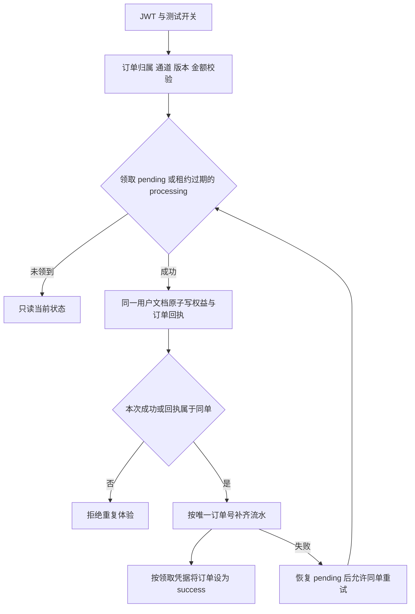

# 支付订单与测试权益

本模块目前提供订单只读查询，以及仅限开发/测试环境的模拟发放。支付宝与微信供应商文件只是未接入的预留实现，没有正式支付回调链路。不能将模拟记录当作真实付款凭证。

## 接口与配置

所有接口由 `PaymentController` 的 `JwtAuthGuard` 保护，身份取自 JWT：

| 接口 | 行为 |
| --- | --- |
| `GET /payment/capabilities` | 当前是否可用、原因和服务端套餐目录 |
| `POST /payment/order` | 校验金额、币种、通道与用户，保存模拟订单 |
| `POST /payment/order/status` | 只读本人订单状态；不查询模拟网关或发放权益 |
| `POST /payment/mock-success` | 确认/恢复本人模拟订单，orderId 必须为 UUID v4 |

`PAYMENT_MODE` 默认 `disabled`。只有 `NODE_ENV=development/test` 且 `PAYMENT_MODE=virtual` 才能创建和确认模拟订单。生产环境即使配置 `virtual` 也拒绝；普通查询仍可读取历史订单。前端以 capabilities 为准显示入口，服务端开关才是权限边界。

`payment-plans.ts` 保留版本 1 的实际价格和权益；客户端不能通过名称、metadata、回调 URL 或金额决定发放内容。套餐权益不是等额小麦币，也不存在无限次数套餐。将来调整规则需要新增版本并按订单版本处理历史订单，不能覆盖版本 1。

## 发放与恢复

- `PaymentRecord.processingToken/processingExpiresAt` 是 60 秒领取租约。后续状态更新必须匹配领取凭据；进程中断后过期可重领。
- `User.hasUsedVirtualPayment` 与默认不返回的 `virtualPaymentOrderId` 同文档原子写入，确保并发不同订单最多发放一次。这个单值回执只适用于每账户一次的模拟权益，不是未来正式多次充值的账本设计。
- 权益已写入但流水失败时，不回滚已发权益；同单重试根据回执跳过增量，仅补齐流水与订单。不是跨文档事务，也没有后台自动补偿队列。
- `UserTransaction.relatedOrderId` 已有唯一稀疏索引；部署需确保索引存在。流水为 upsert，仅插入一次。响应排除密码与内部回执。
- 历史 `hasUsedVirtualPayment=true` 且没有回执的账户不能再模拟；旧 `alipay` 通道订单不能转为模拟订单。没有自动回填或重发旧权益。
- 错误日志只记录订单 ID。领取、写入失败可追踪，不返回模拟成功掩盖异常。

## 验证

单元测试：`pnpm --filter @man-shi-mai/server test test/payment/payment.service.spec.ts`。

编译后运行 `test/integration/payment-recovery.cjs`，要求显式 `RUN_LOCAL_INTEGRATION=1` 及独立 `mongodb://127.0.0.1:27028/msm_phase1`。覆盖真实 MongoDB 下的查询只读、流水故障恢复、同单/跨单并发、租约过期和生产拒绝，不调用支付网关。浏览器联调见 `apps/web/e2e/payment-local.spec.ts`。

正式支付仍需单独接入：验签、实付金额校验、回调幂等、可恢复账务、退款/对账及供应商沙箱验收；设置开关不会自动获得这些能力。
