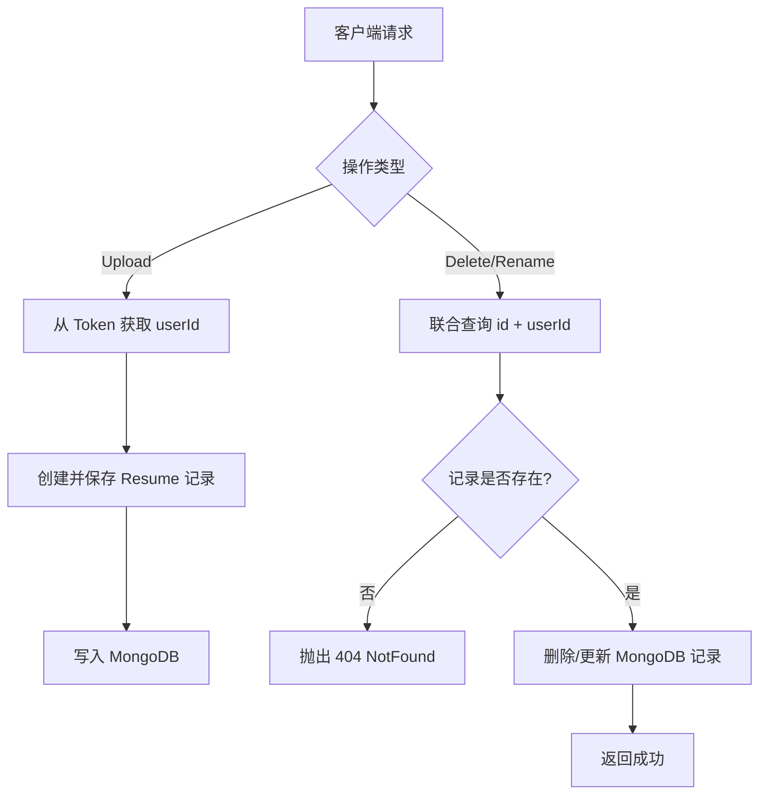

# Backend Module: Resume Metadata Management (简历信息存储管理)

## 1. 业务功能概述 / Business Functionality
- **核心业务逻辑**: 提供用户简历文件的云存储元数据记录（文件名、文件 CDN 链接、上传时间），提供简历的列表查询、上传同步、重命名和物理删除归档。
- **核心数据结构**:
  - `Resume` Schema (MongoDB): 包含 `userId` (关联用户), `resumeName` (简历名), `url` (OSS 中的文件链接), `uploadTime` (上传时间)。

## 2. 核心业务流程图 / Core Business Workflows (Mermaid)

## 3. 架构设计与代码流转 / Architectural Workflow
- **控制器 (ResumeController)**:
  - 文件：`resume.controller.ts`
  - 核心接口（全部路由均受 `JwtAuthGuard` 认证保护）：
    - `GET /resume/getInterviewResumeList`: 获取当前登录用户的所有简历列表。
    - `POST /resume/uploadResume`: 用户上传简历文件后，将文件的 OSS URL 关联记录到数据库。
    - `POST /resume/deleteResume`（body: resumeId）: 删除简历元数据。
    - `POST /resume/updateResumeName`（body: resumeId、resumeName）: 对指定简历进行重命名。
- **简历服务 (ResumeService)**:
  - 文件：`resume.service.ts`
  - 核心逻辑：操作 MongoDB `resumeModel` 进行增删改查。当删除或修改不存在的简历时，抛出 NestJS 自带的 `NotFoundException` (404 状态码)。
- **控制流向 / Data Flow**:
  1. 用户在前端上传文件到 OSS/服务器，并拿到云存储链接 `url`。
  2. 客户端向后端发送 `POST /resume/uploadResume` 并附带 `{ resumeName, url, uploadTime }`。
  3. `ResumeController` 拦截并校验，提取 Token 中的 `userId`。
  4. `ResumeService` 创建简历数据模型记录并保存落库。
  5. 进行简历列表查询时，按 `createdAt` 降序返回给前端。

## 4. 技术依赖与第三方 API / Tech Stack & External APIs
- **核心依赖**: `@nestjs/mongoose`, `mongoose`
- **注意**: 本模块主要处理**元数据**。实际的简历文件文本抽取（PDF/Word 文本提取）由 `interview` 模块中的 `DocumentParserService` 负责。

## 5. 开发约束与边界处理 / Constraints & Guidelines
- **数据隔离**: 在进行任何删、改、查操作时，必须在 Query 中强制限制 `userId`！绝对禁止横向越权操作其他用户的简历记录（即：不能只通过 `resumeId` 去删改数据，必须同时校验 `userId`）。
- **校验**: 简历名更新和上传时，简历名不能为空且字数不能过长。

## 6. 本地调试与排查 / Debugging & Verification
- **调试方式**:
  - 用 Postman 或 Swagger 挂载 Bearer Token。
  - 调用 `GET /resume/getInterviewResumeList`，检验是否能够准确检索出当前测试用户的专属简历列表。
- **异常排查**:
  - 如果返回 `404 简历不存在`：检查是否由于传入 of `resumeId` 与该 Token 解析出的 `userId` 不匹配（越权或ID有误）。

- 重命名/删除 DTO 校验 MongoDB ID，重命名去除首尾空白并拒绝空名称；编辑内容要求对象结构。所有查询、保存与删除继续限定所属用户。删除元数据不代表 OSS 文件已删除。
