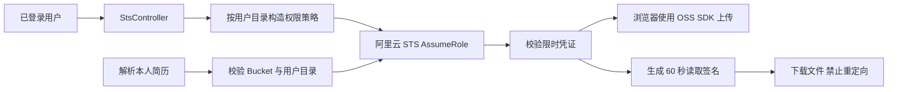

# 文件临时授权

`GET /sts/getStsToken` 要求 JWT，用户 ID 只取已验证的身份。`StsService` 使用官方 `ali-oss` 的 STS 客户端请求 900 秒的角色会话；只返回 STS 凭证，不返回长期密钥。未配置或外部调用失败返回 503，不伪造授权。

权限仅包含配置 Bucket 中 `user-resumes/<userId>/*` 与 `user-img/<userId>/*` 的 PutObject/GetObject，不授予列举、删除或其他用户目录权限。客户端上传和解析均使用 MongoDB 用户 ID，不使用 openid 或 guest 路径。

配置：`OSS_ACCESS_KEY_ID`、`OSS_ACCESS_KEY_SECRET`、`OSS_STS_ROLE_ARN`、`OSS_BUCKET`、`OSS_REGION`。长期身份须可 AssumeRole，角色本身须具备目标目录的 OSS 权限；最终权限是角色权限与请求策略的交集。Bucket CORS 需要允许实际网站来源。真实云端授权、CORS 和上传下载必须在测试 Bucket 验证，单元测试只验证策略、返回值和失败路径。

简历 URL 只接受配置的标准 OSS 域名和当前用户路径；旧 HTTP 链接在新上传记录中规范化为 HTTPS。解析时不使用客户端查询参数，重新生成短期签名并禁用 HTTP 重定向。自定义 CDN、旧非标准路径不自动放行，需明确迁移处理。日志不得输出 SDK 原始异常、签名、密钥或完整下载 URL。

[阿里云浏览器授权文档](https://help.aliyun.com/en/oss/developer-reference/authorize-access-6)
