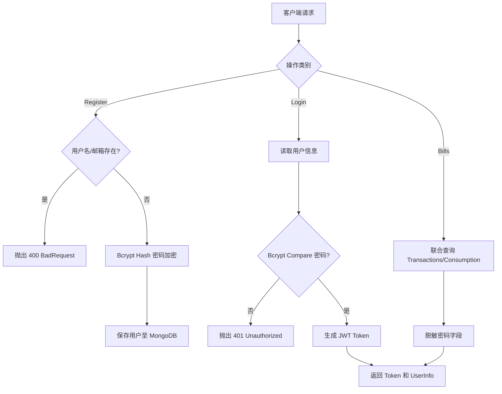

# Backend Module: User Management (用户管理与账户系统)

## 1. 业务功能概述 / Business Functionality
- **核心业务逻辑**: 管理用户账户全生命周期，包括注册、密码登录、获取个人信息、修改资料、消费统计以及获取交易/消费账单。
- **核心数据结构**:
  - `User` Schema (MongoDB): 包含 `username`、`password` (加密存储)、`email`、`role`、`createdAt` 等。
  - `Transaction` / `ConsumptionRecord`: 记录用户的积分充值、消费及各种面试消耗明细。

## 2. 核心业务流程图 / Core Business Workflows (Mermaid)

## 3. 架构设计与代码流转 / Architectural Workflow
- **控制器 (UserController)**:
  - 文件：`user.controller.ts`
  - 核心接口：
    - `POST /user/register`: 公开，注册新用户。
    - `POST /user/login`: 公开，用户密码登录并返回 JWT。
    - `GET /user/info`: 受保护，获取当前登录用户信息。
    - `PUT /user/profile` & `POST /user/update`: 受保护，更新用户信息。
    - `GET /user/transactions`: 受保护，获取充值与订单流水。
    - `GET /user/consumption-records`: 受保护，分页获取用户消费记录。
- **用户服务 (UserService)**:
  - 文件：`user.service.ts`
  - 核心逻辑：实现注册重名检测、使用 `bcryptjs` 进行密码的加盐 Hash 加密及校验、调用 `JwtService` 生成 Token、联合查询用户关联的消费记录。
- **控制流向 / Data Flow**:
  1. 客户端发送注册/登录请求 -> `UserController`。
  2. 校验传入的 `RegisterDto` 或 `LoginDto` 格式。
  3. `UserService` 对密码进行加密/对比，操作 `userModel` (MongoDB) 保存或检索用户。
  4. 登录成功返回 `{ token, user }` 给客户端。
  5. 客户端使用 Token 请求 `info` 或 `consumption-records`。
  6. `UserController` 拦截器鉴权通过后，进入 Service 查询并返回成功结果。

## 4. 技术依赖与第三方 API / Tech Stack & External APIs
- **核心依赖**: `@nestjs/mongoose`, `@nestjs/jwt`, `bcryptjs`
- **加密安全**: 密码不能明文落库，必须使用 `bcryptjs.hash()` 并在验证时使用 `bcryptjs.compare()`。

## 5. 开发约束与边界处理 / Constraints & Guidelines
- **防重名约束**: 注册时邮箱/用户名不能重复，服务中必须做 `findOne` 校验，查出冲突抛出 `BadRequestException` (400)。
- **敏感数据安全**: 查询并返回用户信息时，**严禁**返回密码字段（查询时使用 `select('-password')` 或在响应前剔除）。
- **分页处理**: 消费明细查询接口必须做分页处理，防范百万级查询击穿内存。

## 6. 本地调试与排查 / Debugging & Verification
- **调试方式**:
  - 使用 Postman 直接向 `/user/register` 发送包含 `{ username, password, email }` 的 JSON。
  - 向 `/user/login` 发送账户密码，获取 Token 用于后续受保护接口测试。
- **异常排查**:
  - `登录失败`：核对密码的 hash 比对是否正确。
  - `注册报错`：核对数据库中是否已存在同名或同邮箱记录。

- 资料更新接受 `username`；兼容旧客户端 `nickname`，同时提供时以 `username` 为准。更新字段显式限定为用户名、邮箱、头像和电话，响应使用普通对象后剔除密码；客户端以服务器返回值更新显示。

## 模拟面试开场权益账本

`QuotaLedgerModule` 提供独立 `QuotaLedgerService`。当前仅模拟面试开场接入，简历押题、兑换和支付不属于此幂等保证。

- 操作主键由用户、操作类型和请求 ID 确定；payloadHash 拒绝同 ID 不同金额。用户单文档原子修改权益、quotaRevision 与 quotaReceipt，使用 majority 写确认。
- 先读账户，再读操作状态，再按版本及余额下限条件更新。回执归档前不能被下一笔覆盖；重试可协助归档，不依赖进程内状态或 Mongo 事务。
- 退款先标记取消，再以无金额操作推进账户版本，阻止已经读取旧状态的迟到扣次；实际已扣才执行独立、幂等的反向操作。
- quotaRevision、quotaReceipt 默认不返回给客户端；新注册对象也主动剔除。旧账户缺少版本按 0 处理，不需要启动时回填。操作历史保存在独立集合，不能随意删除已应用回执，否则可能破坏重放判断。
