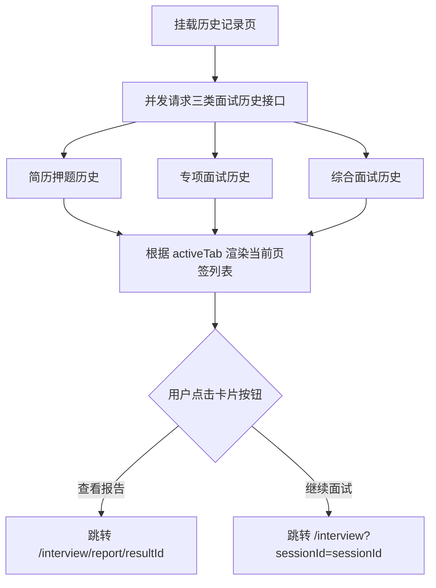

# Frontend Module: Interview History (面试测评历史纪录)

## 1. 业务场景概述 / Page Overview
- **页面功能**: 供用户查看其在该平台上进行过的所有面试测评历史记录（包括：简历押题、专项面试、综合面试）。支持在此页面继续查看未完成的面试，或直接点击进入已生成的测评分析报告。
- **用户交互流程**:
  1. 用户访问 `/history`。
  2. 页面载入三大类型面试的全部历史数据集。
  3. 用户可在页签（简历押题 / 专项面试 / 综合面试）间进行切换。
  4. 对已完成的项目，用户可以点击“查看分析报告”；对未完成的（挂起）项目，用户可以点击“继续面试”。

## 2. 页面渲染与交互流程图 / UI & Interaction Workflows (Mermaid)

## 3. 页面结构与分工 / Layout & Components
- **本页面为一个单独的 Client Component 文件**:
  - 文件：`page.tsx`
  - 主要子组件与展示结构：
    - **页签切换器 (Tabs)**：用于控制当前展示的数据类别。
    - **历史卡片列表 (Card List)**：每条记录渲染为一个卡片，展示岗位名称、公司名称、面试进度（如：提问数、耗时、状态）、更新时间，以及操作按钮。
    - **状态徽章 (Status Badge)**：用不同颜色的标签表示面试状态（如：`已完成` 为绿色，`未完成/进行中` 为黄色）。

## 4. 状态管理与数据流 / State Management & Data Flow
- **本地状态管理**:
  - `activeTab` ('quiz' | 'special' | 'behavior'): 控制当前展示哪个业务类型的历史列表。
  - `quizHistory`, `specialHistory`, `behaviorHistory`: 存放从后端拉取的相应数据集。
  - `loading` (Boolean): 数据获取时的过渡加载状态。
- **API 通信网关**:
  - 简历押题历史：`GET /dev-api/interview/resume/quiz/history`。
  - 专项面试历史：`GET /dev-api/interview/special/history`。
  - 综合面试历史：`GET /dev-api/interview/behavior/history`。
- **重定向控制**:
  - 报告链接跳转至 `/interview/report/[resultId]`。
  - 继续面试跳转至 `/interview?sessionId=[sessionId]`。

## 5. UI 风格与交互约束 / UI Styles & Interaction Constraints
- **卡片悬浮动效**: 列表卡片增加微小的阴影和位移悬浮效果 (`hover:-translate-y-0.5 hover:shadow-md transition-all`)，提高用户的交互体验。
- **空数据占位图 (Empty State)**: 当用户在当前页签下没有任何记录时，展示精美的“暂无记录”提示文案与引导按钮，鼓励用户开启新的面试。

## 6. 调试与验证方法 / Debugging & Verification
- **多状态卡片测试**:
  - 验证当返回的面试历史状态为 `PAUSED` 时，操作按钮是否能正确显示为“继续面试”并携带正确的 `sessionId` 路由跳转。
  - 校验时间格式化函数（`formatDate`）在处理 UTC 时区时间时的表现是否符合本地用户阅读习惯。
