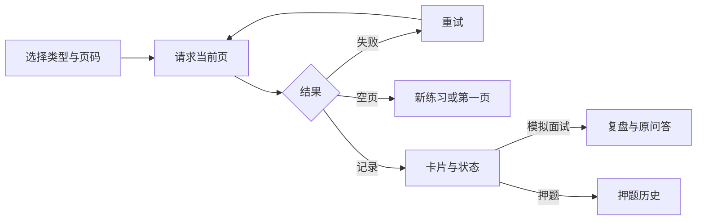
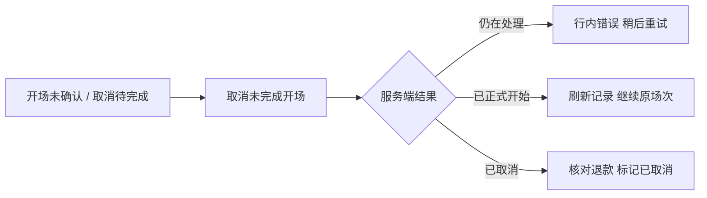

# 练习记录

`page.tsx` 保留工作区导航，使用季节主题卡片与「面试 → 复盘」状态图；无分数时不补分，异常开场可直接核对并取消。

- 请求契约集中在 `src/api/interview-history.ts`；三类接口为 `/interview/resume/quiz/history`、`/interview/special/history`、`/interview/behavior/history`。每页 10 条，切换类型返回第一页。
- 服务端返回 `{ list, total, page, limit }`，按创建时间及 `_id` 倒序稳定分页。前端在滚动发布期间兼容旧服务端返回的完整数组，并在本地切页；响应缺少必要数据时显示错误，不伪装为空列表。
- 切换类型、页码及离开时中止旧请求；异步回调再次检查 signal，防止旧记录覆盖新状态。失败、空页和加载分别显示；分页控件数量固定，记录很多时也不会撑破手机宽度。
- 状态区分进行中、暂停、结束、中止与未知；复盘状态由同一服务端规则计算，过期生成任务显示失败、空回答显示信息不足。列表不返回回答内容、简历或任务租约。
- 模拟面试链接 `/interview/report?serviceType=<类型>&resultId=<id>`；结束场次查看复盘，未结束场次在复盘页查看原问答并使用已实现的继续入口。
- 押题保留 `/interview?serviceType=resume&resultId=<id>&history=true`，可查看题目与已有分析。
- 验证：API 契约单测、`history-local.spec.ts` 的真实 HTTP 分页/状态/键盘跳转/响应式用例，另用刻意网络故障验证重试与请求取消。合成数据库记录不证明模型质量。

## 异常开场

- HistoryItem 增加可选 startStatus，兼容旧列表；prepared/refunding 显示取消按钮，cancelled 明确显示开场已取消。
- 取消 API 只携带 resultId，不依赖本地简历和待确认请求。服务端确认后刷新列表；仅清除本地与该 resultId 对应的会话，不影响其他场次草稿。
- 请求中禁用按钮，409 显示中文处理提示并可重试；网络失败不伪装取消成功。`history-recovery-local.spec.ts` 验证清空本地状态后的真实 HTTP 取消、失败重试和重复取消；数据库验证退还不重复。
