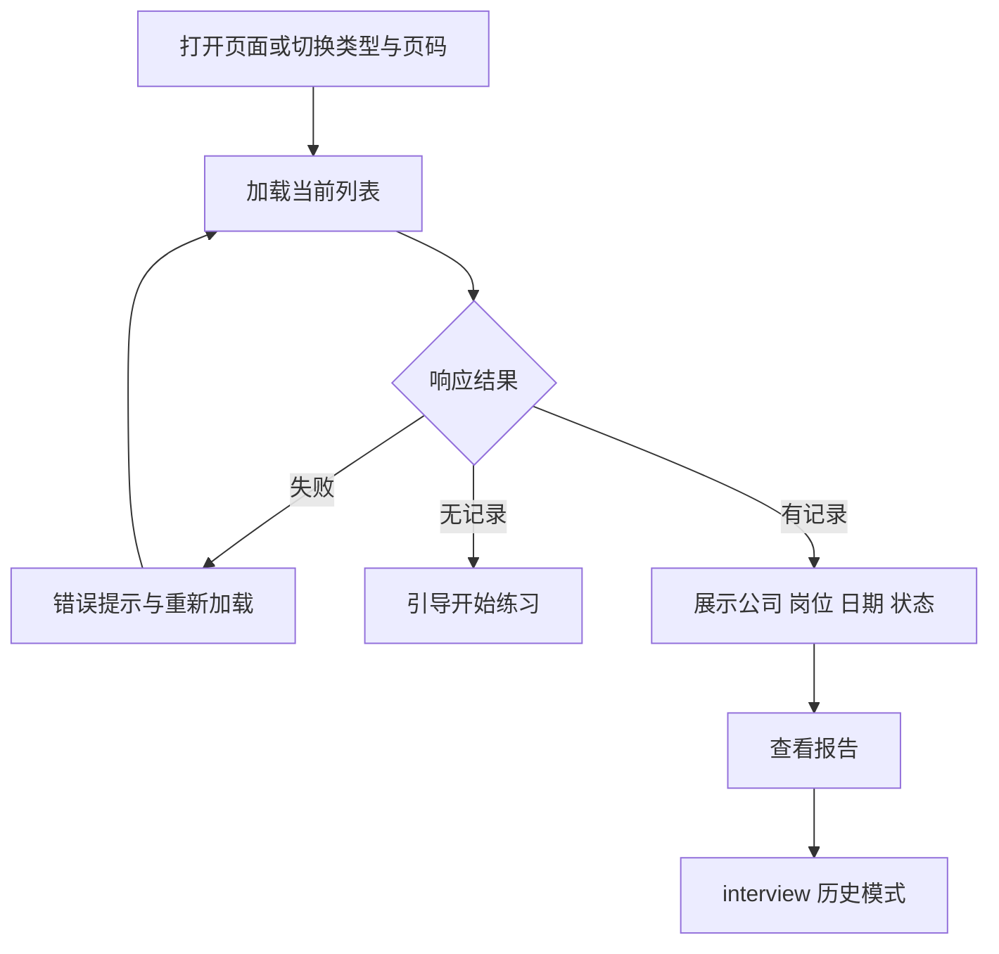

# 练习记录

`page.tsx` 是客户端页面，使用统一的浅色工作区布局。按当前类型请求分页记录，而非预加载所有类型。

- `activeTab` 为 resume、special 或 behavior；每页 10 条，切换类型回到第 1 页。
- 接口分别为 `/interview/resume/quiz/history`、`/interview/special/history`、`/interview/behavior/history`，携带 page 与 limit，通过 request 读取已解包 data。
- 兼容数组、list 或 records 结构。递增 requestId 防止旧请求覆盖新列表。
- 失败与空列表分开显示。刷新与重试使用当前筛选条件，加载中禁用刷新。
- 查看报告要求记录包含 resultId，跳转 `/interview?serviceType=<类型>&history=true&resultId=<id>`。当前没有“继续面试”按钮，不把旧文档中的恢复功能当成该页已实现能力。
- Mock 回归覆盖失败与重试、响应式布局；真实报告数据需测试后端联调。
