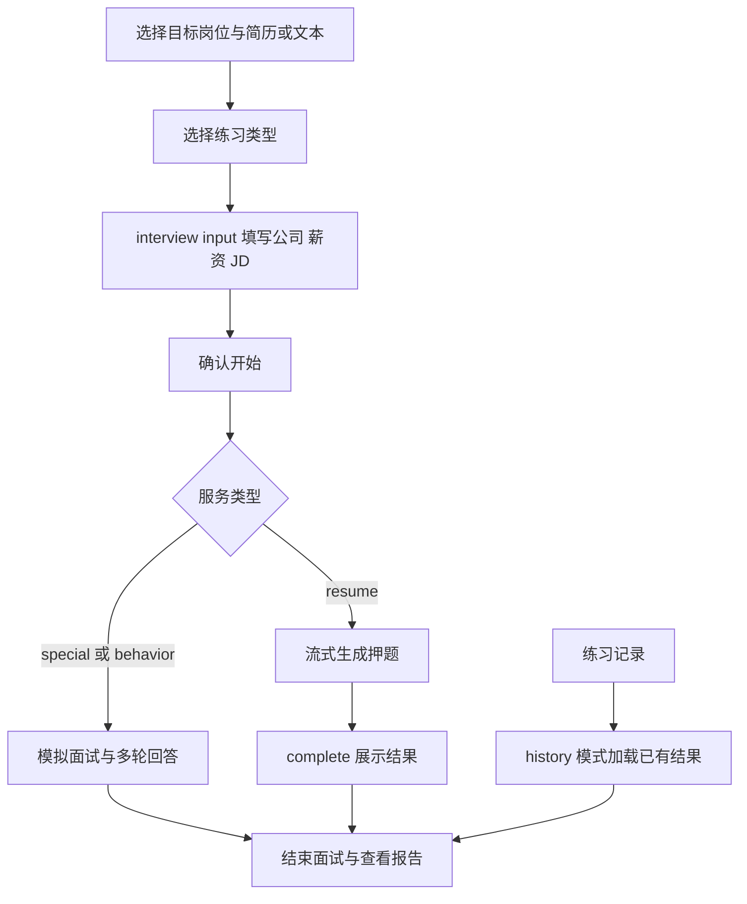

# 面试准备、练习与报告

本模块分为 `/interview/start`、`/interview` 和 `/interview/report`，各路由通过 page.tsx 引入客户端内容。共用 InterviewLayout：桌面使用深色流程侧栏，手机保留顶部返回和步骤提示。

## 准备页

- 岗位来自 job-categories.json，支持搜索、分类与键盘选择；状态保存在 useInterviewStore。
- 简历列表通过 `/resume/getInterviewResumeList` 加载并写入 useUserStore。也可上传、预览、删除或粘贴简历文本。
- 有目标岗位且有简历 ID 或非空文本才启用下一步。粘贴有效文本会清除已选简历 ID。
- 简历中心通过 `?resumeId=` 进入时，成功加载并匹配后预选；不覆盖已有文本、简历或进行中的会话。
- 练习类型弹窗使用原生 dialog，支持 Escape、焦点约束与关闭后返回焦点。选择类型只写状态并跳转，不扣减权益。
- 跳转目标为 `/interview?serviceType=resume|special|behavior&step=input`。

## 练习工作区

- `serviceType` 为 resume、special、behavior；`step` 为 input、progress、interview、complete、error。
- input 收集公司、岗位、薪资和 JD，JD 长度要求 50–2000 字；确认开始、权益检查与后端交互沿用 page.client.tsx 业务处理。
- useInterviewStore 共享岗位、简历、会话、消息和进度。本地状态管理输入、生成进度、弹窗和流连接。
- 普通 HTTP 通过 request；流式请求通过 ssePost 和统一 SSE 代理。不要将 SSE 当成一次性 JSON 请求。
- 押题流：`/interview/resume/quiz/stream`；模拟面试流：`/interview/mock/start`、`/interview/mock/answer`；结束：`POST /interview/mock/end/:resultId`。
- 历史入口使用 `history=true&resultId=`，按类型加载押题结果或模拟问答、历史会话。页面复用 VoiceInputModal、RestoreInterviewModal、InterviewConfirmModal 与语音合成 Hook。
- InterviewLayout 在 progress 或尚未结束的 interview 阶段阻止离开；步骤 complete 与报告页显示复盘阶段。不要仅改变导航外观而移除该守卫。

## 报告与验证

报告页从 `GET /interview/analysis/report/:resultId` 获取结构化评估，使用 RadarChart 展示能力维度，并展示匹配技能、缺失项和建议。缺少 resultId 时返回准备页。

`e2e/ui-redesign.spec.ts` 使用 Mock API 验证断点布局、简历预选、岗位键盘选择、下一步条件、类型弹窗与进入 input。它不发起真实 SSE、模型调用或权益扣减；完整会话、语音授权、断连恢复与交易仍需独立联调。相关修改必须保留流取消、定时器和监听清理逻辑。
