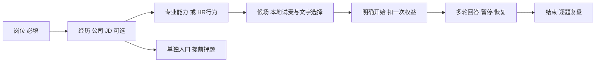
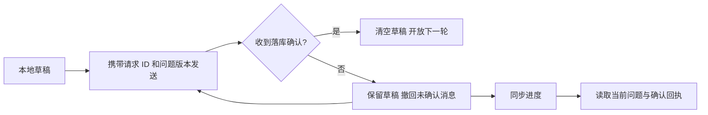

# 面试准备、练习与报告

本模块分为 `/interview/start`、`/interview` 和 `/interview/report`。准备页与候场沿用 DefaultLayout 主导航；正式面试、押题生成与复盘进入 InterviewLayout。仅面试路由的布局读取 query，并置于 Suspense，其他页面保留静态输出。

## 准备页

- 岗位来自 job-categories.json，支持搜索、分类与键盘选择；选择状态保存在 useInterviewStore，返回页面不再自动 reset。
- 目标岗位必选。简历 ID、经历文本、公司、JD 对模拟面试均可选；公司和 JD 收入展开区，未提供经历时标明岗位通用练习。选择新岗位保留已填公司与 JD。
- 简历列表的加载、失败、空数据分别显示。失败提供原地重试、文本输入和通用练习；不把坏响应当成空列表。简历中心的 resumeId 预选不覆盖现有草稿或场次。
- 专业能力与 HR/行为两类以行内按钮选择；默认专业能力。已有进行中或待确认开始时显示继续入口，避免用新开始覆盖未确认请求。提前押题保持单独入口，仍需岗位与简历或经历文本。
- 跳转 `/interview?serviceType=special|behavior&step=input` 后直接候场，不再重复填写表单。押题仍进入原 input 表单。

## 候场与面试室

- `InterviewPreflight` 展示岗位、经历来源、三段流程、回答方式和实际扣次规则。试麦使用 InterviewRecorder，本机录音与回听；不调用 ASR 或上传 API，不建立面试场次。
- 麦克风拒绝、缺失、不支持均给出错误并允许改用文字；离开、切换方式与正式开始会释放设备、朗读与 Blob URL。正在试麦时需停止后再入场。
- 回答方式存入 answerMode；AnswerComposer 按该偏好初始化，并在持久化状态恢复后同步。默认语音，文字随时接管。
- 用户确认开始后进入面试室，保留原倒计时与 durable start 协议。恢复动作开始后，旧延迟初始化不能再次打开恢复弹窗。
- 暂停通过真实后端接口确认，保存草稿并允许离开；继续读取当前问题。再听一遍只朗读当前问题，不提交回答或增加轮次。暂停/结束过程中禁用回答并释放录音。
- useInterviewStore 管理岗位、简历、会话与草稿；HTTP 与 SSE 仍通过统一代理。退出与切换时保留既有取消和清理逻辑。
- 简历押题仍使用原确认与 SSE 入口；此次仅修复经历文本被误判为没有简历，未改造押题计费或新增供应商。

## 报告与验证

押题报告沿用 `GET /interview/analysis/report/:resultId`；模拟面试的 special/behavior 进入 `components/interview/InterviewReview.tsx`，通过 `src/api/interview-review.ts` 查询新复盘接口。缺少 resultId 时返回准备页。

`e2e/ui-redesign.spec.ts` 使用 Mock API 验证断点布局、简历预选、岗位键盘选择、可选简历与直接进入候场。它不发起真实 SSE、模型调用或权益扣减；完整会话、语音授权、断连恢复与交易仍需独立联调。相关修改必须保留流取消、定时器和监听清理逻辑。

### 模拟面试复盘

- 页面先显示本场重点（至多一点优势、两点改进），每项附原文引用、下一次练习建议和原回答锚点；没有足够依据时不强凑数量。本场路线以可点选题目节点展示已答/未答，能力维度用直接标数的横向条形图；没有数据不补图。发现与练法用箭头连接，引用、完整分析和逐题原文按需展开。
- 原问答独立于生成结果展示；历史没有单题评价或引用时明确标记缺失。所有模型文本作为 React 文本渲染，不直接执行 HTML。
- GET `/interview/mock/review/:resultId` 只读；pending/failed 且服务端允许时可 POST 同路径 `/generate` 发起分析，不在 GET 或错误重试中隐式调用模型。
- 仅 generating 状态每 3 秒查询，最多 40 次；404、失败及网络错误停止自动刷新。切换 resultId 或离开页面取消请求并清除计时器。手动刷新保留同场已加载问答。
- `not_ready` 提供返回场次入口；`insufficient_data` 不显示低分。前端校验状态、分数范围和引用与原文的关联，不把 malformed 响应显示为完成。
- `e2e/report-local.spec.ts` 使用独立数据库的合成报告与真实 HTTP，验证锚点、手机布局、状态区分、404 不循环和离开后停止轮询。它不证明真实模型评分质量。

- `ReviewOverview` 负责路线和能力图；题目节点可用键盘选中并跳到对应原文，默认展开第一题。切换场次重置展开状态，春秋招聘季沿用主题变量，不新增硬编码色板。

### 页内语音回答

- `AnswerComposer` 替换旧 `VoiceInputModal`，默认展示语音入口，但不自动申请麦克风。录音 → 校对 → 确认发送；可随时切换文字。转写追加到已有草稿，失败保留音频和文字，重试同一段音频，不自动发送或重新录制。
- `InterviewRecorder` 独占单次设备生命周期；处理延迟授权后的取消、正常停止、录音错误和卸载，清理 track、AudioContext、RAF 与计时器。波形来自实际音量，不使用伪造循环动画。音量分析失败不阻断录音。
- 当前后端是百度短语音整段识别，非实时双工。单段录音 55 秒自动结束、最多 4 MB，支持追加多段；此限制不代替后端时长/大小校验。跨浏览器真实录音与第三方识别质量仍需验证。
- 转写使用统一 HTTP 客户端与 30 秒超时；FileReader 被真正 await，取消时不再覆盖当前草稿。浏览器取消请求不等于服务商已经中止处理或计费。
- 面试官朗读为浏览器 TTS，正常语速、单队列播放；录音前、静音、结束及卸载时取消。停止朗读按钮只停止声音，不再冒充跳过问题或解锁仍在生成的回答。
- `test/interview` 与 `test/api/interview-speech.spec.ts` 验证异步边界；`e2e/voice-input.spec.ts` 用 Chromium 原生 MediaRecorder 与合成麦克风验证界面，ASR/面试接口 Mock，不代表真实语音服务及恢复会话已验收。

### 回答确认与会话恢复

- `answerDraft/pendingAnswer/questionVersion` 随现有 Store 持久化；网络失败、错误事件、提前结束的 SSE 均保留文字。同一文字与版本重试复用 UUID；只有服务端确认后才清除。恢复时仅确认属于自己的请求回执，不把其他窗口推进误当成自己的提交成功。
- `recoverInterview` 使用 `POST mock/resume/:resultId` 并验证响应，不再读取原始 sessionState 或直接修改 messages 数组。恢复同时支持服务重启与暂停；显式 URL 场次优先于浏览器旧场次。切换场次不混入旧草稿，退出登录清除面试内容、待确认请求与活跃场次标识。
- 恢复弹窗使用原生 dialog、键盘焦点约束，以「读取记录 → 继续回答」图示代替冗长警告；返回准备不会声称后端已放弃场次或不可恢复。工具栏「同步进度」可确认断线结果；未结束复盘链接进入该恢复流程。
- 页面卸载关闭回答 SSE、押题 SSE 和恢复请求；恢复期间禁止提交。正在生成时结束操作由后端回合状态决定，不能先在前端假装已结束。
- `turn-local.spec.ts` 使用真实 Next 代理及专用 Mongo/Controller/SSE，模型 Stub，验证已保存但丢失响应后的重试、刷新草稿、两轮回答、提前断流及显式场次链接。与语音页面用例一起回归。上述不代表付费模型、开场扣次及最终报告全链路已完成验收。

### 开场失败与重试

Store 的 `pendingStart` 在请求前保存 UUID 和输入快照。SSE 的 ready 快照及确认事件到齐才清除；断线、刷新后沿用原请求，避免重新扣次。错误区提供「重试开始 / 取消开始」；取消经普通 HTTP 代理确认后才返回准备页，服务端已 ready 则引导恢复。退出登录同时清理 pendingStart。`start-local.spec.ts` 验证真实代理的开场响应丢失、刷新重试与零次数取消；模型和实际语音质量另行验收。

### 从准备到复盘的本地验收

`preparation-local.spec.ts` 配合 `test/integration/start-recovery.cjs` 的 KEEP_START_SERVER、TEST_START_PORT 和 START_FIXTURE_PATH，在专用 Mongo 上连接真实 Controller、JWT、DTO、开场、扣次、回合、暂停/恢复、结束与报告服务。浏览器分别检查试音回听和拒绝授权后文字接管，完成两轮回答并生成带原文引用的复盘。模型/报告输出为明确 Stub，用户资料和简历列表为 Mock；不代表真实登录、ASR 或模型质量验收。禁止将该服务作为生产 API。
