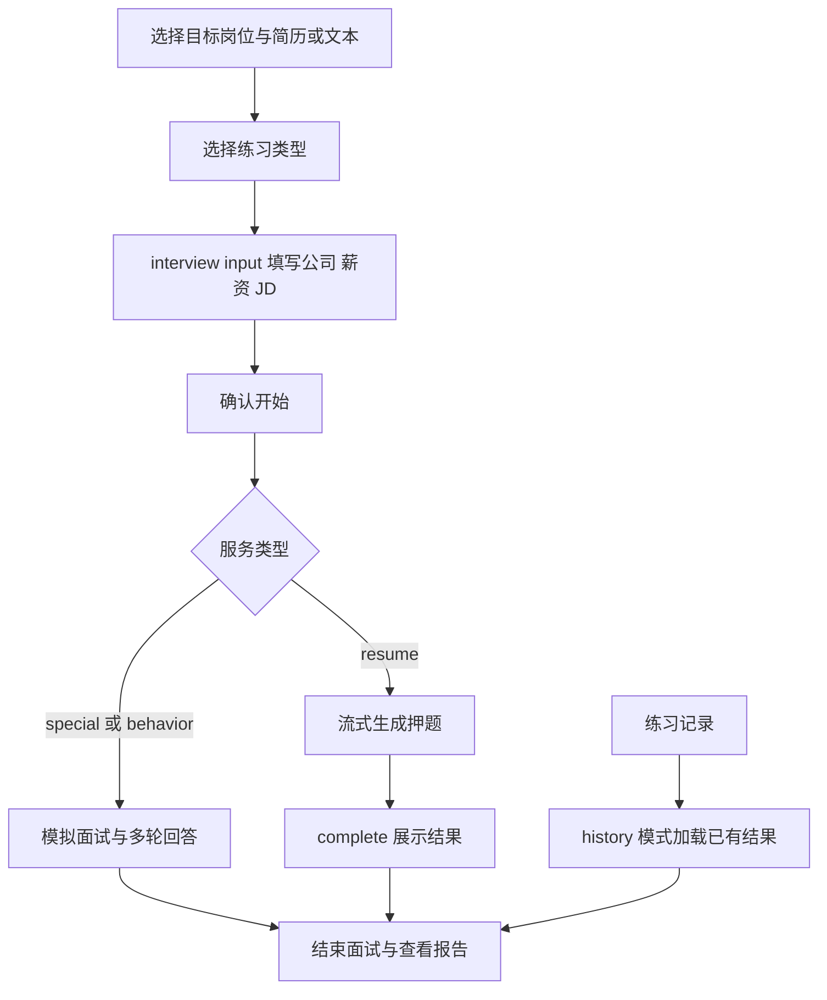

# 面试准备、练习与报告

本模块分为 `/interview/start`、`/interview` 和 `/interview/report`，各路由通过 page.tsx 引入客户端内容。共用 InterviewLayout：桌面使用深色流程侧栏，手机保留顶部返回和步骤提示。

## 准备页

- 岗位来自 job-categories.json，支持搜索、分类与键盘选择；状态保存在 useInterviewStore。
- 简历列表通过 `/resume/getInterviewResumeList` 加载并写入 useUserStore。也可上传、预览、删除或粘贴简历文本。
- 有目标岗位且有简历 ID 或非空文本才启用下一步。粘贴有效文本会清除已选简历 ID。
- 简历中心通过 `?resumeId=` 进入时，成功加载并匹配后预选；不覆盖已有文本、简历或进行中的会话。
- 练习类型弹窗使用原生 dialog，支持 Escape、焦点约束与关闭后返回焦点。选择类型只写状态并跳转，不扣减权益。
- 跳转目标为 `/interview?serviceType=resume|special|behavior&step=input`。

## 练习工作区

- `serviceType` 为 resume、special、behavior；`step` 为 input、progress、interview、complete、error。
- input 收集公司、岗位、薪资和 JD，JD 长度要求 50–2000 字；确认开始、权益检查与后端交互沿用 page.client.tsx 业务处理。
- useInterviewStore 共享岗位、简历、会话、消息和进度。本地状态管理输入、生成进度、弹窗和流连接。
- 普通 HTTP 通过 request；流式请求通过 ssePost 和统一 SSE 代理。不要将 SSE 当成一次性 JSON 请求。
- 押题流：`/interview/resume/quiz/stream`；模拟面试流：`/interview/mock/start`、`/interview/mock/answer`；结束：`POST /interview/mock/end/:resultId`。
- 历史入口使用 `history=true&resultId=`，按类型加载押题结果或模拟问答、历史会话。页面复用 AnswerComposer、RestoreInterviewModal、InterviewConfirmModal 与语音合成 Hook。
- InterviewLayout 在 progress 或尚未结束的 interview 阶段阻止离开；步骤 complete 与报告页显示复盘阶段。不要仅改变导航外观而移除该守卫。

## 报告与验证

押题报告沿用 `GET /interview/analysis/report/:resultId`；模拟面试的 special/behavior 进入 `components/interview/InterviewReview.tsx`，通过 `src/api/interview-review.ts` 查询新复盘接口。缺少 resultId 时返回准备页。

`e2e/ui-redesign.spec.ts` 使用 Mock API 验证断点布局、简历预选、岗位键盘选择、下一步条件、类型弹窗与进入 input。它不发起真实 SSE、模型调用或权益扣减；完整会话、语音授权、断连恢复与交易仍需独立联调。相关修改必须保留流取消、定时器和监听清理逻辑。

### 模拟面试复盘

- 页面先显示本场重点（至多一点优势、两点改进），每项附原文引用、下一次练习建议和原回答锚点；没有足够依据时不强凑数量。本场路线以可点选题目节点展示已答/未答，能力维度用直接标数的横向条形图；没有数据不补图。发现与练法用箭头连接，引用、完整分析和逐题原文按需展开。
- 原问答独立于生成结果展示；历史没有单题评价或引用时明确标记缺失。所有模型文本作为 React 文本渲染，不直接执行 HTML。
- GET `/interview/mock/review/:resultId` 只读；pending/failed 且服务端允许时可 POST 同路径 `/generate` 发起分析，不在 GET 或错误重试中隐式调用模型。
- 仅 generating 状态每 3 秒查询，最多 40 次；404、失败及网络错误停止自动刷新。切换 resultId 或离开页面取消请求并清除计时器。手动刷新保留同场已加载问答。
- `not_ready` 提供返回场次入口；`insufficient_data` 不显示低分。前端校验状态、分数范围和引用与原文的关联，不把 malformed 响应显示为完成。
- `e2e/report-local.spec.ts` 使用独立数据库的合成报告与真实 HTTP，验证锚点、手机布局、状态区分、404 不循环和离开后停止轮询。它不证明真实模型评分质量。

- `ReviewOverview` 负责路线和能力图；题目节点可用键盘选中并跳到对应原文，默认展开第一题。切换场次重置展开状态，春秋招聘季沿用主题变量，不新增硬编码色板。

### 页内语音回答

- `AnswerComposer` 替换旧 `VoiceInputModal`，默认展示语音入口，但不自动申请麦克风。录音 → 校对 → 确认发送；可随时切换文字。转写追加到已有草稿，失败保留音频和文字，重试同一段音频，不自动发送或重新录制。
- `InterviewRecorder` 独占单次设备生命周期；处理延迟授权后的取消、正常停止、录音错误和卸载，清理 track、AudioContext、RAF 与计时器。波形来自实际音量，不使用伪造循环动画。音量分析失败不阻断录音。
- 当前后端是百度短语音整段识别，非实时双工。单段录音 55 秒自动结束、最多 4 MB，支持追加多段；此限制不代替后端时长/大小校验。跨浏览器真实录音与第三方识别质量仍需验证。
- 转写使用统一 HTTP 客户端与 30 秒超时；FileReader 被真正 await，取消时不再覆盖当前草稿。浏览器取消请求不等于服务商已经中止处理或计费。
- 面试官朗读为浏览器 TTS，正常语速、单队列播放；录音前、静音、结束及卸载时取消。停止朗读按钮只停止声音，不再冒充跳过问题或解锁仍在生成的回答。
- `test/interview` 与 `test/api/interview-speech.spec.ts` 验证异步边界；`e2e/voice-input.spec.ts` 用 Chromium 原生 MediaRecorder 与合成麦克风验证界面，ASR/面试接口 Mock，不代表真实语音服务及恢复会话已验收。
