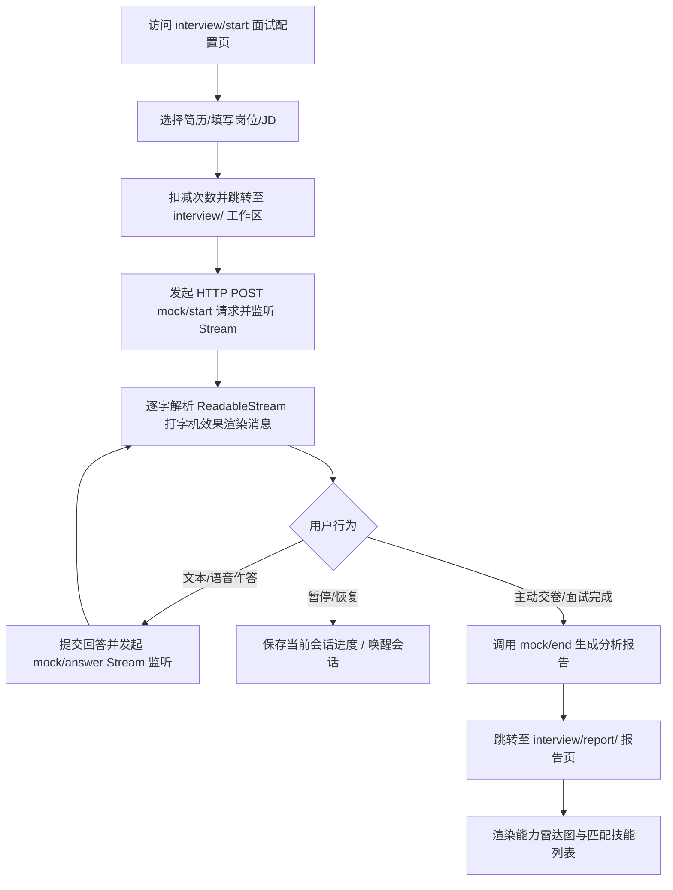

# Frontend Module: AI Interview Workspace (AI 面试工作流与测评报告)

## 1. 业务场景概述 / Page Overview
- **核心业务逻辑**: 本模块为用户提供全套的模拟面试交互。包括：
  1. **配置开启 (start/)**：选择面试类型、简历、岗位，贴入 JD，完成下单配置。
  2. **面试实战 (interview/)**：与 AI 面试官进行流式实时会话，支持选择文本或语音录音作答，支持暂停、恢复或主动交卷。
  3. **打分报告 (report/)**：获取结构化的面试评估，使用图表展示技术匹配度、雷达能力模型、缺失的技能和改进建议。

## 2. 页面渲染与交互流程图 / UI & Interaction Workflows (Mermaid)

## 3. 页面结构与分工 / Module Directory Structure
本模块包含三大核心路由页面：

### 2.1 面试配置页 (`src/app/interview/start/`)
- **page.tsx** & **page.client.tsx**:
  - 用户在此选择要押题或模拟的类型（简历押题/专项/综合）。
  - 选择本地已上传的简历模板，贴入招聘岗位、目标公司、具体 JD 要求。
  - 点击“开启”将扣减剩余次数，开启后跳转到对应的面试工作区。

### 2.2 面试实战工作区 (`src/app/interview/`)
- **page.tsx** & **page.client.tsx**:
  - 核心互动室。展示面试官的实时对话框。
  - **流式对话获取 (SSE)**：支持与后端 SSE 接口进行流式打字机应答渲染。
  - **语音交互**：支持麦克风录音并转换为语音文本进行快捷作答。
  - **控制条**：提供暂停面试、恢复进度和主动交卷并生成报告的按钮。

### 2.3 面试报告展示区 (`src/app/interview/report/`)
- **page.tsx** & **page.client.tsx**:
  - 最终成果展示。从后端拉取打分报告 JSON。
  - 显示多维度雷达图（技术、行为、软实力、项目匹配度）。
  - 列出 matchedSkills (匹配技能点) 和 missingSkills (缺失技能点)。
  - 展示大模型提供的具体建议反馈、错题整理与正确示范答案。

## 4. 状态管理与数据流 / State Management & Data Flow
- **流式请求管理 (SSE)**:
  - 客户端通过 `fetch` 的 `ReadableStream` 逐字解析服务端返回的 EventStream 事件，将流式文本追加到最新的一条 AI 消息中，实现打字机效果。
- **全局状态**:
  - 使用 `useUserStore` 读取用户信息以确保当前次数充足；使用 Toast 通知展示连接状态。
- **API 通信网关**:
  - `POST /dev-api/interview/mock/start`: 启动流。
  - `POST /dev-api/interview/mock/answer`: 用户回答提交流。
  - `GET /dev-api/interview/analysis/report/:resultId`: 请求分析报告。

## 5. UI 风格与交互约束 / UI Styles & Interaction Constraints
- **交互规范**: 对话泡泡有不同的气泡样式和背景（用户侧为浅绿，AI 侧为纯白或浅灰色）。
- **语音控制**: 开启语音录制时展示波形微动效，防止用户重复录音。录音时应处理浏览器音频调用授权异常。
- **SSE 防撕裂**: 流数据解析时，必须有加载占位符，且接收到的 JSON 必须安全解析防止 `JSON.parse` 格式错误引发白屏。

## 6. 调试与验证方法 / Debugging & Verification
- **模拟流数据调试**:
  - 若需要测试打字机渲染，可在本地调试时在 network 中调低网速，观察 `page.client.tsx` 中逐字累加的 `messages` 数组渲染是否抖动或导致页面滚动中断。
- **异常捕获**:
  - 测试断网情况下，SSE 连接被异常截断后，页面是否会弹出重试提示并保存已生成的问答上下文。
