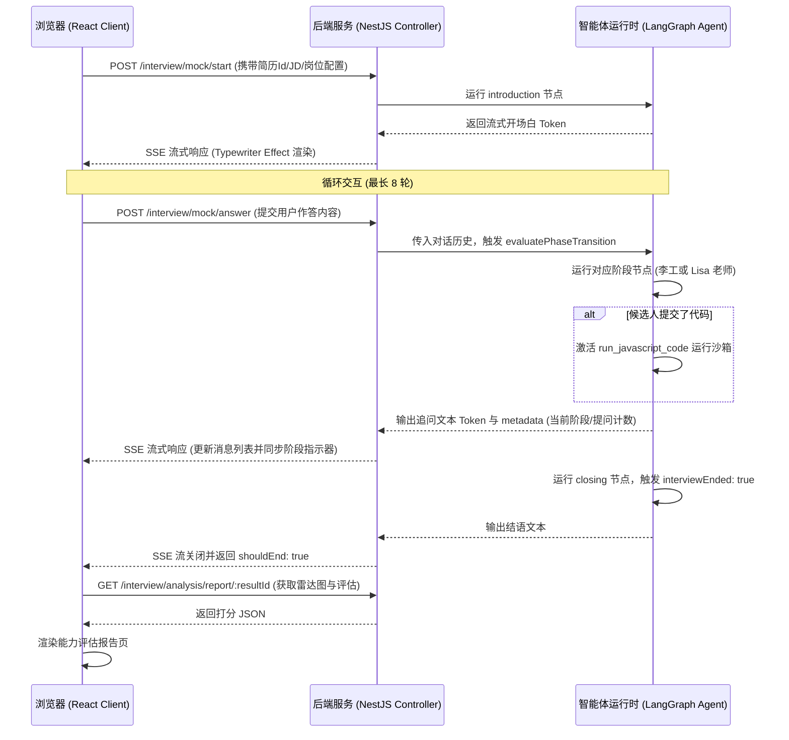

# Frontend Agent Integration Workflow (前端智能体对接与流式渲染设计)

本文档记录了前端 Next.js 应用在模拟面试工作区中与后端 LangGraph 智能体的对接机制、SSE (Server-Sent Events) 逐字渲染逻辑以及会话状态更新的流程。

---

## 1. 核心页面流转与会话生命周期 (Lifecycle)

前端面试过程由以下三个核心页面组成，数据流向和会话进度通过后端返回的 `metadata` 进行同步：

---

## 2. 核心技术实现细节 (Technical Details)

### 2.1 Server-Sent Events (SSE) 逐字解析流
- 前端通过 `fetch` 的 `body.getReader()` 开启可读流，配合 `TextDecoder` 对分片字符进行逐字合并拼接。
- 解析到的每段文本实时追加到最新消息的 `content` 字段上，驱动组件重新渲染，呈现流畅的打字机输出效果。
- 对话容器通过 `scrollIntoView({ behavior: 'smooth' })` 保持自动随文字生成而向下滚动。

### 2.2 消息类型渲染与代码块支持
- 会话消息流使用 Markdown 格式渲染气泡内容：
  - **普通文本**：由 HR “Lisa” 老师或技术官 “李工” 发出，展现专业与亲和语气。
  - **代码块 (Codeblocks)**：当“李工”或者候选人提交手写代码（如 LRU 实现）时，通过 `react-markdown` 结合代码高亮组件（如 `prismjs` 或 `highlight.js`）以精美等宽字体高亮渲染，方便候选人直接在界面审查。

### 2.3 状态同步与指示器变化
- 每次接收到 SSE 响应完毕后的最终区块中，均包含 `metadata` 字典（包含 `currentPhase`、`questionsAskedCount` 和 `extractedSkills`）。
- 前端在流关闭时，捕获此 `metadata`：
  - 更新页面顶部的**当前面试阶段指示器**（当前处于哪位面试官、第几阶段）。
  - 更新提取到的**技能标签列表**。
  - 若 `shouldEnd` 为真，延时 2 秒弹出报告生成提示，并跳转至最终打分报告页。

### 2.4 健壮性与断网重连 (Robustness)
- 在流读取的 `try-catch` 结构中，如果连接中断或解析 JSON 失败：
  - 页面会弹出 Toast 警告，并将当前连接状态置为“连接异常”。
  - 输入框和控制条提供“重新获取”或“保存进度退出”选项，防止候选人辛苦做答的内容因单次网络错误而丢失。
