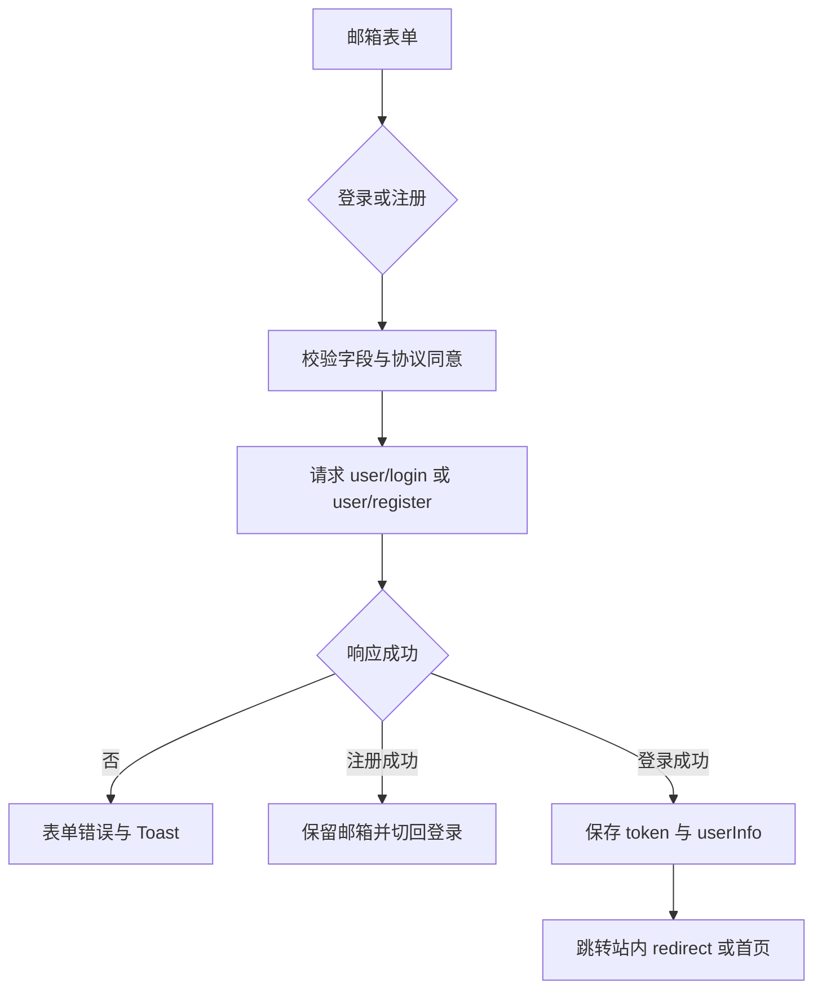

# 登录与注册

`page.tsx` 提供路由入口，`page.client.tsx` 中的 `LoginPageContent` 组合介绍区与 `LoginEmailPanel`。介绍区跟随招聘季配色。桌面双栏，手机压缩介绍区；字段有可见标签、自动填充属性和错误提示。不使用背景气泡动画。

- 登录提交邮箱、密码；注册增加至少 3 字符的用户名。协议默认勾选，取消勾选后阻止提交。
- 请求使用 `/dev-api/user/login`、`/dev-api/user/register`。注册成功不要求 Token；登录成功必须含 `user` 与 `token`。
- 登录更新 `useUserStore` 并保存本地状态，500ms 后跳转。只接受以 `/` 开头且不以 `//` 开头的 redirect。
- 切换模式清空输入与错误；请求中禁用提交和切换按钮。服务协议、隐私政策新标签打开。
- UI Mock 回归见 `e2e/ui-redesign.spec.ts`；真实登录注册回归见 `e2e/auth-flow.spec.ts`，需要测试后端。
