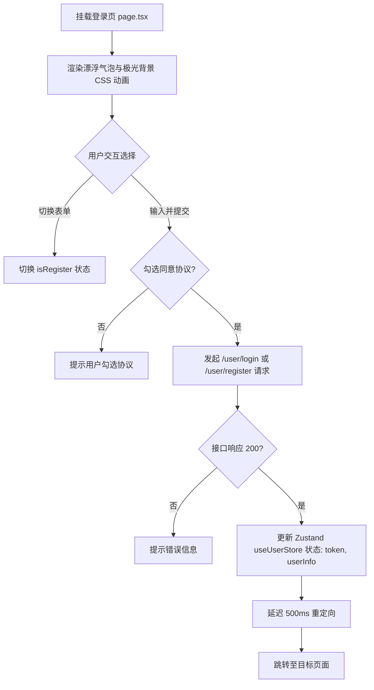

# Frontend Module: Login & Registration (登录与注册模块)

## 1. 业务场景概述 / Page Overview
- **页面功能**: 用户在前端进行邮箱密码注册、邮箱密码登录。提供服务协议和隐私政策勾选，并处理路由重定向。
- **用户交互流程**:
  1. 用户访问 `/login`，展示背景脉冲气泡动效。
  2. 用户选择“去注册”或“去登录”进行表单切换。
  3. 勾选“阅读并同意协议”后，输入账号密码（或加用户名）提交。
  4. 登录成功，本地通过 Toast 反馈并延时 500ms 重定向到之前拦截的页面或根路径 `/`。

## 2. 页面渲染与交互流程图 / UI & Interaction Workflows (Mermaid)

## 3. 页面结构与组件划分 / Layout & Components
- **服务端组件 (Server Entry)**:
  - 文件：`page.tsx`
  - 职责：配置 Metadata 标题（"登录 - 面试麦"）与视口设置，引用客户端组件 `LoginPageContent`。
- **客户端核心组件 (Client Component)**:
  - 文件：`page.client.tsx`
  - 主要子函数组件：
    - `LoginPitch`: 宣传介绍模块（说明产品核心三大方向）。
    - `LoginFlowCard`: 功能流程说明引导卡片（Steps: 目标选择 -> 多轮模拟 -> 结构反馈）。
    - `LoginEmailPanel`: 邮箱/密码表单控制板，处理登录注册的逻辑切换及表单提效。
    - `LoginPageContent`: 包含全屏动效（如气泡、极光背景动画渲染）和整体容器排版。

## 4. 状态管理与数据流 / State Management & Data Flow
- **本地状态管理**:
  - `isRegister` (Boolean): 切换登录/注册表单模式。
  - `agree` (Boolean): 用户是否勾选协议（默认 true，未勾选拦截请求）。
  - `loading` (Boolean): 避免重复提交的加载锁。
- **API 通信网关**:
  - 请求后端：`/dev-api/user/login` 或 `/dev-api/user/register`。
- **全局状态同步**:
  - 使用 `@/stores/userStore` (`useUserStore`) 同步：
    - `setIsLogin(true)`
    - `updateUserInfo(payload.user)`
    - `setToken(payload.token)`
  - 使用 `@/stores/toastStore` (`toast`) 触发成功/警告通知提示框。

## 5. UI 风格与交互约束 / UI Styles & Interaction Constraints
- **全局背景**: 采用 `from-neutral-900 via-neutral-900 to-neutral-800` 深色极简风格，配合毛玻璃效果卡片 (`backdrop-blur-md bg-white/5`)。
- **CSS 动效**: 定义了四种纯 CSS 关卡动画（`orbPulse`、`beamSweep`、`bubbleFloat`、`bubbleDrift`）来渲染漂浮气泡与极光。
- **表单校验**: 提交前对注册用户名长度（至少3个字符）及协议同意状况做拦截提示。

## 6. 调试与验证方法 / Debugging & Verification
- **UI 调试**:
  - 点击“切换模式”按钮，观察表单项（如“用户名”输入框）的显示/隐藏动画是否流畅。
- **联调要点**:
  - 监控 Chrome DevTools Network 中的 `login` 接口响应。确保其结构中携带了 `token` 且能存入本地 Storage/Zustand Store。
