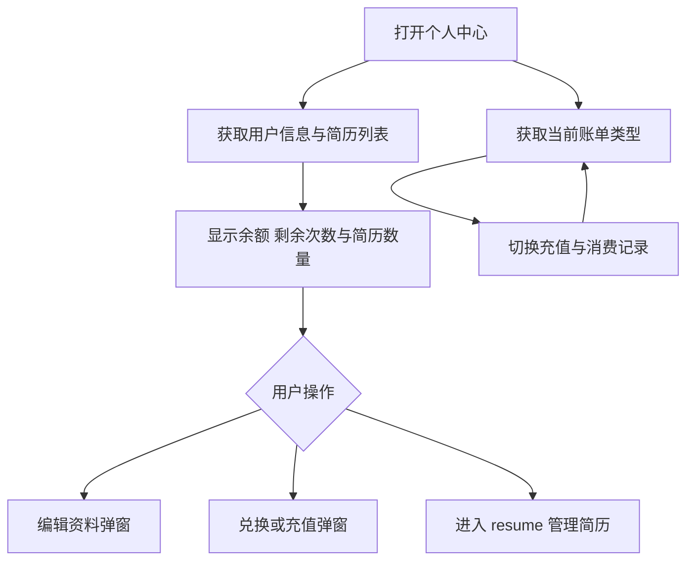

# 账户与权益

`page.tsx` 展示个人信息、小麦币与剩余次数、简历中心入口、充值及消费记录。使用跟随招聘季的浅色工作区与深色账户卡片；窄屏为单列，工具栏允许换行。

- 用户信息来自 `getUserInfoAPI`；简历来自 `/resume/getInterviewResumeList`，写入 useUserStore。
- 充值记录为 `/user/transactions`，消费记录为 `/user/consumption-records`，只请求当前类型。当前无分页控件。
- 复用 EditProfileModal、RedeemServiceModal、RechargeModal。交易与余额确认以现有后端及弹窗逻辑为准，页面样式调整不改变兑换或充值契约。
- 简历编辑、上传和删除的主要入口在 `/resume`；本页显示数量和跳转按钮，不展示旧文档描述的内嵌预览、改名或删除列表。
- UI Mock 检查响应式布局；支付与兑换需要独立的后端联调，不能用 UI 截图代替实际交易验证。

- 资料编辑使用 `/user/update` 的实际返回值更新 Store，不能用提交表单覆盖服务器未接受的字段。上传回调直接读取请求封装解包后的 `_id`。
- 文件授权改用后端下发的 Bucket、地域和有效 STS Token；不接受空 Token，也不回退到长期凭证。新上传路径使用 MongoDB 用户 ID，简历格式为 PDF/DOCX。
