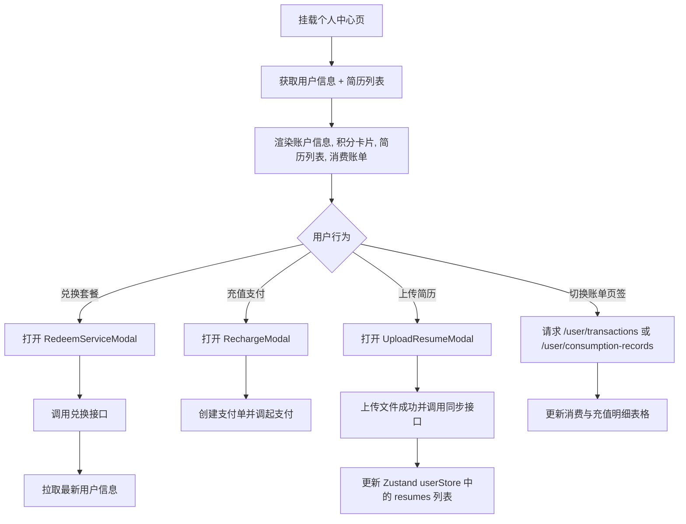

# Frontend Module: User Profile & Account (用户个人中心与账户权益)

## 1. 业务场景概述 / Page Overview
- **页面功能**: 用户在前端查看个人信息、编辑个人头像和昵称、上传与管理简历列表（最大5份）、预览/重命名/删除简历文件、查询小麦币余额与三种面试类型（押题/专项/综合）的剩余次数、使用代币兑换套餐以及进行充值。
- **用户交互流程**:
  1. 用户访问 `/profile` 路径。
  2. 触发加载简历列表及最新账户权益数据。
  3. 用户可以点击“兑换”或“充值”调起对应的模态框 (Modal) 执行交易。
  4. 支持在“充值记录”与“消费记录”两个页签进行切换，分页查询资金流向与消费明细。

## 2. 页面渲染与交互流程图 / UI & Interaction Workflows (Mermaid)

## 3. 页面结构与组件划分 / Layout & Components
- **本页面为一个单独的 Client Component 文件**:
  - 文件：`page.tsx` (使用 `'use client'`)
  - 核心子组件 / 模态框：
    - `EditProfileModal`: 弹出修改头像昵称。
    - `UploadResumeModal`: 弹出进行简历拖拽或选择上传。
    - `RedeemServiceModal`: 消耗 20 小麦币进行次数兑换。
    - `RechargeModal`: 弹出选择充值套餐调起支付。
    - `简历删除确认弹窗`: 二次确认是否调用接口删除简历。
    - `简历改名弹窗`: 输入新名称（限10字内）保存。
    - `简历 iframe 预览弹窗`: 全屏弹窗，内嵌 `iframe` 加载 PDF 文件预览链接。

## 4. 状态管理与数据流 / State Management & Data Flow
- **本地状态管理**:
  - `activeRecordTab` ('recharge' | 'consumption'): 控制消费/充值账单的页签显示。
  - `rechargeRecords` & `consumeRecords`: 保存拉取到的充值和消费记录明细数组。
  - `editNameModal`: 临时存放正在编辑名称的简历对象和位置。
  - `previewResume`: 存放当前要预览的简历文件详情以控制预览弹窗。
- **API 通信网关**:
  - 获取信息：`getUserInfoAPI()` (通过 `@/api/user`)。
  - 简历模块：`GET /resume/getInterviewResumeList`、`POST /resume/deleteResume`、`POST /resume/updateResumeName`。
  - 账单流水：`GET /user/transactions`、`GET /user/consumption-records`。
- **全局状态同步**:
  - 使用 `useUserStore` (`userStore`) 更新 `resumes` 状态，以便在整个应用的其他模块（如开始面试时）同步简历选择器。

## 5. UI 风格与交互约束 / UI Styles & Interaction Constraints
- **色彩排版**: 采用清新浅色调 `from-gray-50 via-white to-gray-50`。
- **权益卡片**: 账户总览设计为微渐变立体卡片 (`from-primary-600 to-primary-700`)，以增强视觉质感。
- **限制约束**: 简历名额上限限制 `MAX_RESUME_COUNT = 5`，超过 5 份时“上传简历”按钮禁用，更改为文本提示。

## 6. 调试与验证方法 / Debugging & Verification
- **数据加载测试**:
  - 在 network 中验证 `transactions` 与 `consumption-records` 的接口返回格式，避免因不同后端字段包裹（如 `.records` 或 `.list`）导致前端列表空白。
- **交互验证**:
  - 确认在简历进行删除或更名操作后，本地 Zustand 中的 `resumes` 数据是否同步刷新而无需手动 F5 刷新页面。
