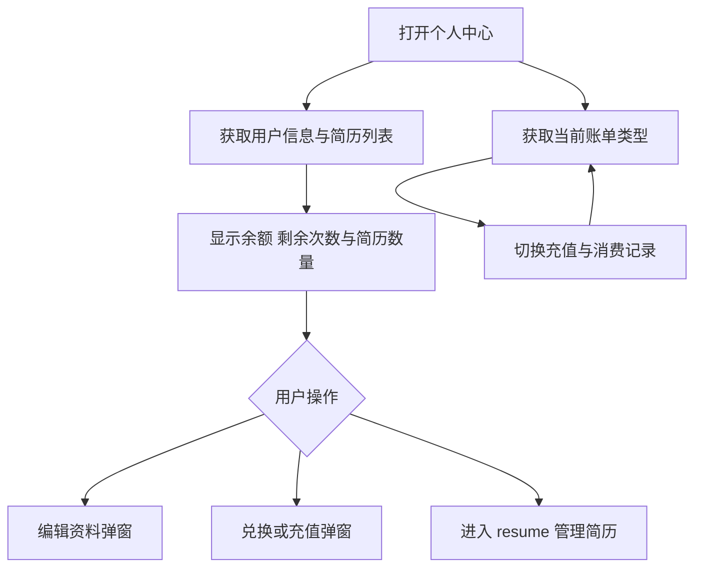
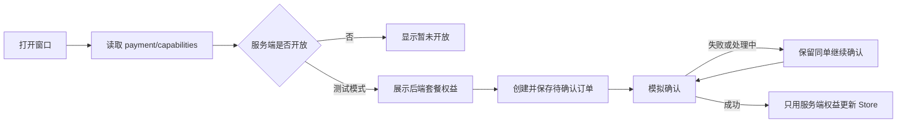

# 账户与权益

`page.tsx` 展示个人信息、小麦币与剩余次数、简历中心入口、充值及消费记录。使用跟随招聘季的浅色工作区与深色账户卡片；窄屏为单列，工具栏允许换行。

- 用户信息来自 `getUserInfoAPI`；简历来自 `/resume/getInterviewResumeList`，写入 useUserStore。
- 充值记录为 `/user/transactions`，消费记录为 `/user/consumption-records`，只请求当前类型。当前无分页控件。
- 复用 EditProfileModal、RedeemServiceModal、RechargeModal。交易与余额确认以服务器返回为准。
- 简历编辑、上传和删除的主要入口在 `/resume`；本页显示数量和跳转按钮，不展示旧文档描述的内嵌预览、改名或删除列表。
- UI Mock 检查响应式布局；支付与兑换需要独立的后端联调，不能用 UI 截图代替实际交易验证。

- 资料编辑使用 `/user/update` 的实际返回值更新 Store，不能用提交表单覆盖服务器未接受的字段。上传回调直接读取请求封装解包后的 `_id`。
- 文件授权改用后端下发的 Bucket、地域和有效 STS Token；不接受空 Token，也不回退到长期凭证。新上传路径使用 MongoDB 用户 ID，简历格式为 PDF/DOCX。

## 充值窗口

`RechargeModal` 使用原生 dialog，支持键盘焦点约束、Escape 关闭、关闭后返回入口。加载失败可重试，关闭时取消 capabilities 请求。

- 请求集中在 `src/api/payment.ts`，校验响应类型、状态一致性和权益数量。真实路由为 `/payment/order`、`/payment/order/status`、`/payment/mock-success`；未使用的旧错误路由封装已移除。
- 前端不推算赠币、不展示虚假折扣、命中率、无限套餐或二维码。模拟操作明确不扣款。
- 待确认订单按用户 ID 保存到 sessionStorage，关窗和同标签页刷新可恢复；只在服务器确认成功后清除。存储不可用时保留当前内存订单。正式支付需要服务端订单列表恢复方案，不能依赖浏览器存储。
- 每账户一次模拟权益由服务端原子校验，已有消费标记仍允许恢复同一待确认订单。
- `e2e/payment-local.spec.ts` 仅在显式本地集成模式运行，用真实后端验证响应丢失后刷新重试不重复发权益；正式支付未验证。
