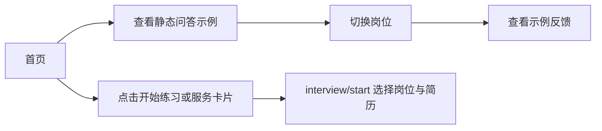

# 首页与互动示例

首页由 HomeHero、HomeServices、HomePractice、HomeFeatures、HomeSteps、HomeCTA 组成。外围共用 AppHeader、Footer 与 Brand；服务说明与流程保持服务端组件；HomeHero 与 HomeCTA 读取招聘季主题，PracticePreview 管理示例交互状态。

首屏使用招聘季海报、简历与 Offer 票据插画；顶部可以手动预览春招/秋招或跟随时节，规则见 `../season/Agent.md`。互动问答放在 HomePractice 区。

示例覆盖前端、产品、运营，切换岗位会清除已展开的反馈。示例内容写在组件内，明确标注为示例，不发起 AI 请求、不产生练习记录。服务卡片进入统一准备页，服务类型在完成岗位和简历选择后确定。

移除了随机在线人数组件。宣传内容不能添加没有数据来源的成功率、命中率或用户量。设计细则见仓库 `design-system/mianshimai/MASTER.md`；移动菜单、示例切换、反馈及窄屏回归见 `e2e/ui-redesign.spec.ts`。
