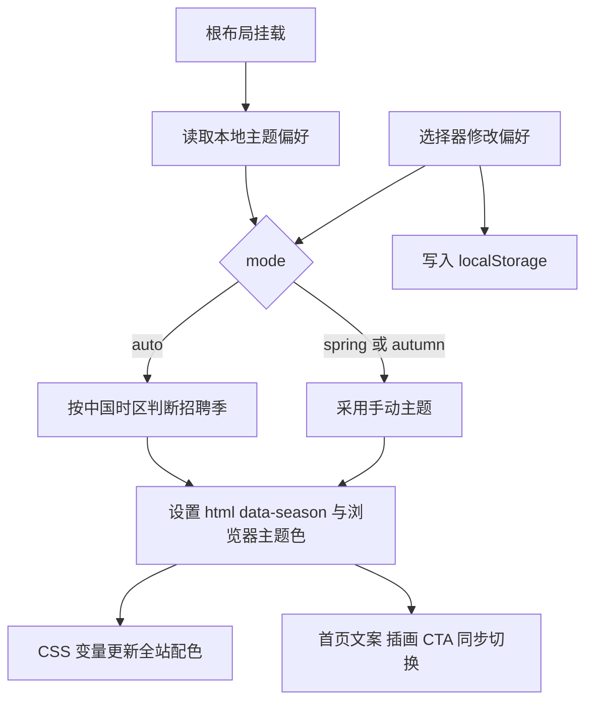

# 招聘季主题

根布局挂载 SeasonProvider，首页通过 useSeason 获取同一份主题状态。组件不依赖用户登录，也不发起网络请求。

- 档期与内容：`src/lib/recruitment-season.ts`；2–6 月春招，其余为秋招及补录。日期判断使用 Asia/Shanghai，不依赖浏览器所在地。
- 本地键名 mianshimai-season，仅接受 auto/spring/autumn；无效值按自动模式处理。禁用存储时仍可在当前会话切换。
- 自动模式每分钟检查一次日期，页面恢复可见时立即检查。卸载清理定时器及监听。
- SeasonSwitcher 使用原生 select；SeasonArtwork 用 SVG/CSS 组合简历、票据、枫叶或花朵、路径与对话贴纸。
- 枫叶、花朵动效短暂播放后停止；减少动态效果时禁用。插画属于示意，不表示已有真实 Offer。
- 单元测试覆盖跨年与中国时区月边界；UI 测试覆盖自动选择、手动切换、刷新/跨页面保持、窄屏和减少动态效果。
