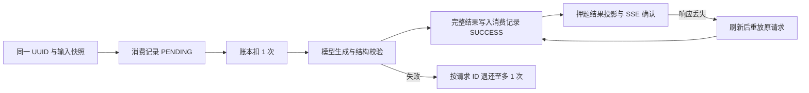

# 第一阶段实施与验收记录

状态：实施中，尚未达到可上线门槛。Agent 架构深化、Jev、面经广场和完整简历编辑器未启动。

## 工作区与范围

- 两个旧仓库已从工作区移至系统废纸篓，保留原 Git、未提交文件及本地配置；开发只在 `apps/`。
- 采用 [重构方案](refactor-agent-jev-plan.md) 第一阶段的完整验收标准，不以局部修复代替面试全流程验收。

## 已有证据

- 标准 `pnpm build:server` 与 `pnpm start:server` 可启动，不再需要临时 `NODE_PATH`；本地独立 MongoDB 的根接口返回 200。
- 后端用户/简历/配置相关测试通过；覆盖真实 ValidationPipe 字段保留、非法输入、资料响应不含密码、旧 nickname 映射及禁止更新权益字段。
- 前端代理测试通过；HTTP 与 SSE 共用运行时后端地址，透传请求体、鉴权与取消信号，保留上游错误类型，拒绝任意 SSE 目标。
- `test/integration/core-http.cjs` 分别直连本地后端及通过 8002 前端 `/dev-api` 通过：注册/登录、资料保存后重查、简历创建/保存/改名/删除、跨用户拒绝。
- 两端 lint 通过（后端有既有 unused warnings）；两端生产构建通过。后续新增改动仍需再次验证对应范围。

- `test/integration/stream-quota.cjs` 直连后端和通过前端代理均通过：零额度仍为零、缓存 SSE 完成并关闭、8 个并发兑换仅 1 个成功、继续对话拒绝未登录/未知会话。使用合成缓存数据，未调用模型。

## 正在处理及剩余门槛

1. 权益：零额度退款及并发兑换已修复并通过实际接口；继续完善扣次/退款幂等及账务失败恢复。
2. 文件：已改为真实 STS 调用、限定用户目录、校验临时凭证；解析重新签名且禁止重定向。Mock 策略/失败路径通过，真实云端上传、CORS、私有文件预览和头像读取仍需完成验证。
3. 支付：已隔离虚拟支付，默认关闭且生产拒绝；订单查询只读，发放与用户回执原子写入，流水失败可同单恢复。真实支付尚未接入，配置与沙箱需单独验收。
4. 面试：页内分段语音、文字接管和本地转码链路已验证；场次恢复与回答去重已通过真实数据库及浏览器检查；准备入口合并、候场和开场扣次幂等仍在处理。
5. 复盘：已抽取复盘服务、增加逐题原文与证据、明确状态和失败重试；历史分页已完成联调；真实模型质量、完整面试结束后的全链路仍需验收。
6. 发布验收：完整两轮面试、暂停/恢复、刷新/重启、拒绝麦克风、异常与重试；真实模型/语音质量单列，不以 Mock 通过代替。

## 成熟产品参考与本项目取舍

- [Yoodli 练习流程](https://support.yoodli.ai/en/articles/9550465-practice-with-yoodli)：练习后查看分析、回答追问。应用到本项目为清晰的提问/回答/反馈阶段，结束后仍可回到具体问答。
- [Yoodli 场景配置](https://support.yoodli.ai/en/articles/9628260-customizing-practice)：允许配置练习场景和结束方式。应用到本项目为岗位与经历设置，以及用户可主动结束；挑战强度必须由用户选择。
- [Google Interview Warmup](https://grow.google/certificates/interview-warmup/)：回答分析展示相关术语与话题覆盖，也可能没有足够分析信息。应用到本项目为反馈关联回答证据，信息不足时明确说明，不凭空给结论。

以上借鉴公开流程，不表示已测试这些产品当前中文识别质量，也不复制其界面或评分模型。

## 本地验证方式

只对显式配置独立数据库的本地服务运行（会创建合成账户）：

```bash
RUN_LOCAL_INTEGRATION=1 TEST_API_BASE=http://127.0.0.1:3000 node apps/server/test/integration/core-http.cjs
RUN_LOCAL_INTEGRATION=1 TEST_API_BASE=http://127.0.0.1:8002/dev-api node apps/server/test/integration/core-http.cjs
```

可设置 `NEXT_DIST_DIR=.next/phase1` 单独构建和启动测试前端，避免覆盖已运行实例的构建产物。构建与启动要使用相同目录；后端地址在运行时通过 `BACKEND_API_URL` 设置。

## 本批检查结果

- 冻结锁文件安装及根 `pnpm check` 通过；本批前端 43 项、后端 69 项单元测试通过，后端 lint 为 0 错误、21 条既有警告，两端构建通过。
- 新构建的 8003 前端通过真实 HTTP/SSE 与 Chromium 资料修改、刷新回读测试。未配置 STS 角色时实际接口返回 503 且不返回凭据；跨用户上传记录被拒绝。
- 尚未推送或部署。实际 OSS、付费模型、语音质量及正式支付未验证；不代表第一阶段已完成。
- 已向用户询问首版采用限额免费体验还是正式支付；该业务选择待答复，暂不改动新用户权益规则。

## 支付链路重构验收

- 套餐目录由服务端统一提供；移除前端不实币数、折扣、无限包、命中率和模拟二维码。充值关闭时页面显示不可用，已有权益仍可使用。
- 支付/用户模块 27 项后端测试、支付契约 5 项前端测试通过；两端 lint 与构建通过（后端 19 条既有警告、0 错误）。
- 独立 MongoDB 的 `test/integration/payment-recovery.cjs` 验证查询不发放、流水故障后恢复、同单重复确认、8 个不同订单并发仅发一次、过期租约恢复和生产模式拒绝。
- 新构建前端 8004/8005 与独立测试后端 3001/3002 的 Chromium 联调通过：移动端可操作、Escape 关闭并返回焦点；真实服务器已发放而浏览器丢失响应后，刷新仍用同单确认，权益不重复增加；关闭模式没有模拟按钮且 API 返回 503。
- 模拟账务采用每账户一次的单值回执，不是正式多次充值方案；同标签页通过 sessionStorage 恢复待确认订单，没有后台自动补偿。真实支付未接入、未部署，不能据此宣布第一阶段完成。

## 复盘链路重构验收

- 模拟面试复盘由独立 `InterviewReportService` 管理，查询只读，用户显式发起生成；并发任务原子领取、有界重试、过期租约恢复、旧结果写入隔离。无回答不再给默认低分，模型缺字段不再默认补 75/80 分。
- 新报告保存 `interview-evidence-v1` 及具体问题/原文引用，校验引用属于该题回答。页面展示本场重点、逐题原文、下一次练习建议；旧数据没有依据时如实显示缺失。
- 后端报告与面试可靠性共 16 项单元测试、前端复盘契约 3 项测试通过；两端构建与 lint 通过，后端保留 19 条既有警告。
- `report-recovery.cjs` 使用真实独立 MongoDB 与 AI Stub，验证 8 个并发生成请求仅调用一次、租约恢复、旧任务不能覆盖新结果、最多 3 次失败重试、原问答保留及跨用户拒绝。
- `report-http.cjs` 通过新构建 8006 前端和 3003 后端验证所有读取状态、401/404、旧地址完成报告适配，以及空回答不生成评分；合成报告不调用外部模型。
- Chromium 3 项交互检查通过：引用锚点、手机无横向溢出；失败/未生成/信息不足状态区分；404 不重复查询，离开生成中页面后停止轮询。
- 尚未验证真实模型评分质量；引用存在不等于评分语义准确。面试进入流程、语音、会话恢复、扣次幂等及完整两轮 E2E 仍未完成，第一阶段仍在实施中。

部署注意：新旧报告地址均保留，但旧地址不再隐式发起模型任务，需要配套发布新版复盘页；生成任务通过用户重试恢复，未实现后台任务扫描。历史报告不自动回填或重新生成。

## 图形化调整

按用户要求减少连续文字：复盘加入题目路线、真实维度条形图、发现到练法的关系卡片。原文与分析未删除，改为按题展开；颜色同时配合题号、已答/未答标签和分值，不单靠颜色传意。使用 UI/UX Pro Max 的分类对比图与信息优先级规则，不增加虚构趋势、进步百分比或候选人排名。

图形化版本的前端 lint、生产构建及 3 项真实 HTTP 浏览器用例通过；新增键盘选择题目、展开对应原文、维度条形图数值、390px 与 1440px 布局检查。此批未改变模型评分或后端协议。

## 练习记录联调与图形化

- 历史页改为响应式卡片与「面试 → 复盘」状态图，减少说明文字；分别呈现暂停、进行中、结束、中止、生成失败和信息不足。结束场次直接进入复盘，未结束场次可查看原问答，尚不宣称会话恢复已完成。
- 三个历史 API 真正执行分页和计数，默认 10、最多 50；创建时间相同时用 `_id` 排序，限定当前用户与类型。前端取消过期请求，兼容旧全量数组，固定数量分页按钮避免宽度随页数增长。
- 25 项后端相关单元测试、4 项前端契约测试通过；两端 lint 与生产构建通过，后端 19 条既有警告、0 错误。独立 MongoDB 的 `history-http.cjs` 通过新构建 8008 前端/3004 后端，验证三类各 23 条数据的跨页不重复、越界空页保留总数、归属隔离、字段白名单及非法查询拒绝；未调用模型。
- 接口响应统一为 `{ list, total, page, limit }`；仓库现有前端可读，新前端还兼容旧数组。无参数请求改为默认第一页，外部数组消费者需调整。分页非快照，新增记录可能移动跨页位置；未部署。

Chromium 两项历史页检查通过：真实三页数据、类型切换回第一页、各状态、键盘打开复盘、390px/1440px 布局；刻意网络故障可重试，离开慢请求的类型后不被旧结果覆盖。

## 页内语音回答与朗读

- 旧语音弹窗已替换为页内「录音 → 校对 → 发送」，默认语音入口但不自动索取麦克风。可追加多段、回听、编辑，识别失败保留同段音频与草稿；切换文字或结束后清理设备和异步任务。
- 浏览器 TTS 恢复正常语速，采用单个活动播放队列；旧回调也遵守静音状态。停止朗读只停止声音，不再改变业务生成状态。手机顶部控件可换行且不挤成竖排文字。
- 当前服务使用[百度短语音标准版](https://ai.baidu.com/ai-doc/SPEECH/qlcirqhz0)，服务商要求完整文件且不超过 60 秒。前端单段 55 秒自动停止、允许继续补充，最多 4 MB；这不是实时双工对话，也不代替服务端请求限制。
- 12 项单元测试覆盖延迟授权后取消、正常/自动停止释放设备、取消转写不覆盖输入、失败后重试、手动确认、TTS 排队/静音/卸载，以及 FileReader 和统一 HTTP 契约。前端 lint、生产构建通过。
- Chromium 原生 MediaRecorder + 合成麦克风的 2 项页面检查通过：首段失败保留草稿、同音频重试、编辑后才提交、切换文字/结束面试关闭所有 track、手机布局。语音服务和面试恢复/回答接口使用 Mock，这些检查不证明真实识别质量、后台会话恢复或多轮扣次链路。
- 后端音频校验、超时和单实例限流已在后续批次补齐；待完成生产 HTTPS 与实际设备/识别质量验收；回答提交失败后的草稿保留与幂等将在会话重构中一并处理。尚未推送部署。

## 后端语音与跨端联调

- 音频校验、转码、识别拆为独立服务；保留现有请求响应结构。输入最大 4 MB，限定四类音频容器，按解码 PCM 拒绝超过 60 秒内容；转码最长 8 秒并杀进程清理，Token/识别分别 5/12 秒超时。
- 单用户单并发且每分钟 8 次、实例最多 4 并发；该内存限流不等于分布式限流。凭据缺失明确 503，禁止自动重试付费识别，不输出原始供应商错误或敏感输入。
- 23 项后端测试与 8 项前端相关测试通过；两端构建及 lint 通过（后端 18 条既有警告）。测试曾发现 DOMException 超时被误判为普通异常，已改为按受检 name 区分并回归通过。
- `speech-http.cjs` 的真实 JWT/DTO/HTTP + ffmpeg 检查通过：WAV/WebM/Ogg/M4A 均转码、超长/损坏/播放列表拒绝、临时目录无残留；供应商为 Stub。完整 AppModule 也已启动，缺少百度配置时实际返回 503。
- 新构建 8012 前端到 3005 测试服务的 3 项浏览器用例通过，包含原生 MediaRecorder 录音经实际 HTTP 代理、JWT、DTO、ffmpeg 后填回文字；其余面试会话接口与识别供应商为 Mock/Stub，不代表真实云端识别质量或整场面试已完成验收。
- 未推送或部署。实际百度账户、生产 HTTPS/设备质量、多实例配额仍需验收；会话恢复、扣次幂等、准备流程和完整两轮面试仍未完成。


## 持久化回合与断线恢复

- 抽取 `InterviewTurnService`，移除主服务的模拟面试 Map、分步占位保存及旧结束保存逻辑。一次原子更新保存回答、下一题、Agent 状态和重放回执；只有保存后发送等待或结束确认。
- 请求 ID + 问题版本防止同轮重复推进，租约与写入条件阻止过期任务覆盖新结果。服务重启可直接从 Mongo 恢复，暂停时间不计入面试时长，超时结束仍保存最后回答。恢复 DTO 兼容 Mongo Mixed 可选字段的 null。
- 前端保留失败草稿和待确认请求，刷新继续；支持同步进度，恢复显式链接场次，不误进旧场次。恢复弹窗改为短流程图与两个动作，移除未实际执行的「放弃不可恢复」警告；退出登录清理本地面试草稿。
- 后端 26 项相关测试、前端 10 项相关测试通过；两端 lint 与构建通过（后端 16 条既有警告、0 错误）。真实 JWT/DTO/SSE/Mongo 的并发、重放、服务实例重建、过期租约、失败恢复、暂停/结束与最后回答用例通过，模型为 Stub。完整 AppModule 启动后也通过同场次恢复接口检查，未调用模型。5 项 Chromium 用例通过，覆盖真实代理、响应丢失重试、两轮作答、刷新草稿、提前断流、指定场次恢复、键盘与语音回归。
- 该保证仅针对已创建场次的回合，不包含开场扣次/退款及消费流水幂等；真实供应商取消、模型质量和完整从开场到报告链路仍待验收。仅保留最近一轮确认回执，更早请求由版本拒绝。
- 新回答协议要求 `requestId/expectedVersion`，须停止旧后端写入后配套发布前后端；旧标签页需刷新恢复。未推送、未部署，第一阶段仍未完成。

## 开场扣次与取消恢复（本轮限定验证）

- `InterviewStartService` 抽出开场准备、确认、重放及取消；`QuotaLedgerService` 以账户版本与持久化回执保证模拟面试开场重复请求不多扣、补偿不多退。开场模板及简历快照在扣次前准备；数据库故障沿同 ID 恢复，取消操作阻止迟到扣次。
- 前端保存 pendingStart 输入快照，刷新和断线重试复用请求 ID；确认前保留失败状态，取消成功才返回准备页。未修改准备表单、模型 Prompt、支付或引入 Agent/Jev。
- 已通过：后端 43 项相关测试、前端 6 项相关测试、两端 lint 和生产构建，后端 15 条既有警告、0 错误。完整 AppModule 依赖启动检查通过。
- 独立 MongoDB + 真实 JWT/DTO/HTTP/SSE 验证：8 个并发开始只扣一次、实例重建重放、同 ID 参数冲突、零次数不退款、取消先于开始、简历失败不扣次、扣次回执归档故障恢复、确认写入故障后只退一次、过期扣次被取消屏障拦截。账户内部字段不返回普通查询。
- Chromium 2 项真实 Next 代理检查通过：开场已保存但响应丢失后刷新沿同 ID 恢复；零次数明确失败并取消返回准备页。测试无付费供应商调用，使用合成账户；未验证真实模型/语音质量、OSS 或完整上线环境。
- 本轮按用户要求停止扩展，只收尾当前改动。第一阶段仍未整体完成：准备入口、整场真实服务验收及生产配置等仍待处理；简历押题与兑换尚未接入该账本。新开始协议要求 requestId，须配套发布两端；未推送、未部署。

## 一次准备、候场试音与整场本地联调

- 准备与候场沿用主导航，正式面试才进入专注布局。合并模拟面试的重复表单，岗位必选、简历/JD/公司可选；返回保留草稿，简历加载/失败/空列表分别显示，押题保留单独入口。
- 新增候场组件，提供本机试麦回听、浏览器朗读试听、语音/文字选择与扣次提示；只在明确开始后调用开场接口。试音不上传、不扣次数；释放设备和本地 URL。
- 面试室接入真实暂停/继续接口与当前问题重听，暂停保留草稿；重听不提交新回答。修复刷新后回答方式丢失、快速恢复后旧延迟初始化重复弹窗，以及展开表单后按钮被页脚遮挡。
- 15 项前端相关单元测试通过，前端 lint 和最终生产构建通过。最终构建的 10 项 UI 回归通过，覆盖 375/768/1024/1440px、导航、简历预选、可选经历、登录、历史错误、招聘季与减少动态效果。
- 新增 `preparation-local.spec.ts` 两项整场浏览器检查：真实 Next HTTP/SSE 代理 → JWT/DTO → Mongo 开场扣次 → 两轮回答 → 暂停恢复 → 刷新草稿 → 结束 → 生成带回答证据的报告。分别覆盖试麦回听和拒绝麦克风后文字接管。数据库复核两场均为 completed、每场两条回答与完成报告，合计只扣两次。
- 上述整场测试的问答/报告模型是 Stub，账户资料和简历列表是 Mock，采用独立合成账户；不代表真实模型、ASR、OSS 与上线环境验收。当前 120 分钟上限未改，热身/标准/挑战及配套阶段规则仍待贯通；未推送、未部署。

### 下一步收尾范围

1. 功能尾项：练习强度与时长规则、失去本地草稿后的异常开场处理入口。
2. 账务尾项：押题的同请求幂等、跨文档故障恢复；兑换已在后续批次接入账本。
3. 上线验收：真实模型/语音/文件服务、生产配置、最终整体检查与发布证据；真实支付未接通时保持禁用。

## 丢失本地草稿后的异常开场处理

- 新增按当前用户 resultId 取消已有开场的接口，复用既有取消屏障与账本退款；不再要求浏览器持有原始输入。其他用户/不存在记录 404，活跃开场 409，旧记录拒绝退款，已 ready 只返回 ready，已取消可重复查询。
- 模拟面试历史增加可选 startStatus 白名单字段；未确认/退款待完成的卡片可直接取消，响应确认后刷新。未返回原始简历、请求摘要或租约。网络失败保留行内错误，409 显示可操作的中文提示；其他场次的本地草稿不被清除。
- 后端 13 项相关测试、前端 5 项契约测试通过；两端构建与 lint 通过，后端 15 条既有警告、0 错误。真实 JWT/DTO/HTTP/Mongo 验证跨用户拒绝、无原始 DTO 的重复取消、ready 不退款和历史白名单。
- 最终生产构建上的浏览器用例通过：清空本地状态，从历史取消两条异常开场，中间注入 409 并重试；数据库复核恰好退还两次，重复取消未再加次数。使用专用合成账户，无付费服务请求。未推送、未部署。
- 此轮发现旧阶段默认值会在首次回答后重复要求自我介绍；已在随后「练习强度与阶段规则」批次修复并验证。

## 练习强度与阶段规则

- 候场可选热身、标准、挑战；服务端分别限制 15 / 30 / 45 分钟、6 / 12 / 18 次作答，每阶段追问上限 1 / 2 / 3。扣次均为一次。待确认开场保留原强度请求快照，不能在重试时换档；恢复面试以服务端已存规则为准。旧场次不回填、不缩短原有时长。
- 新场次开场白之后直接进入岗位相关阶段，避免第一轮回答后再要求自我介绍。题目提示改为贴合岗位，非技术岗位不强制编程；候选人提问阶段不假装知道具体公司的薪资和招聘安排。
- 后端相关单元测试、前端恢复契约测试及 lint / 构建通过；独立 MongoDB 的 JWT/DTO/HTTP/SSE 验证三档开场和热身第 6 次回答保存后结束。新构建前端到测试后端的两场完整浏览器流程通过，分别选热身与挑战，包含返回候场、刷新恢复、结束及复盘；390px 候场刷新与未扣次检查通过。模型输出仍是 Stub，真实模型的阶段流转和提问质量尚未验收。

## 小麦币兑换账务恢复

- 兑换要求 UUID 请求 ID。20 小麦币与 1 次权益在账户单文档内由持久化账本同时修改；相同 ID 重试不会重复兑换，同 ID 换服务类型拒绝。交易记录使用账本操作 ID 唯一补写；若账户已变更而流水暂时写失败，浏览器保留请求 ID，再次提交只修复流水。
- 兑换弹窗在请求前按账户保存待确认请求，刷新后锁定原服务类型并可重试；以服务端确认值更新余额和对应次数。去掉未验证的“命中率 80%+”和固定一小时话术。
- 后端相关 7 项单元测试、两端 lint 与后端构建通过；独立 MongoDB 的真实 JWT/DTO/HTTP 验证 8 个同 ID 并发、余额不足、参数冲突及流水故障恢复。新构建前端的 390px 浏览器用例模拟服务端成功后丢失响应，刷新重试后核对只扣 20 币、只加 1 次权益、只有 1 条交易记录。旧兑换历史不回填；新接口需配套发布前端。真实支付仍未启用。

## 简历押题的扣次与断线恢复



- 新建押题先落消费记录，再按同一 UUID 用账本扣次。并发或响应丢失不会多扣；失败退款可恢复。完整模型输出和 SUCCESS 状态一起保存，投影写入失败后只补投影，不把已生成的结果退款或重跑。旧成功记录按原 resultId 只读重放。
- 前端在请求前保存与账户绑定的输入快照，刷新或失败时重试同一 ID；只以 `yati-complete` 的有效 resultId 确认完成。服务器明确终态失败才允许新请求。SSE 关闭不等于模型已取消，租约过期重试可能增加模型成本，但不会重复扣用户次数。
- 后端单元、lint、构建及专用 MongoDB 的真实 JWT/DTO/HTTP/SSE 验证通过：8 个并发同 ID 只扣一次、输入冲突拒绝、模型失败只退一次、主记录写入状态不明时重试不退款、结果投影故障修复、旧记录重放。新构建前端到本地测试后端的 390px 浏览器用例通过：第一次响应丢失后刷新，两次请求体相同，数据库只新增一条消费记录、一次扣次和一次模型调用。模型为 Stub，未调用付费供应商。
- `requestId` 现为必填；上线需先发布新版前端，再发布后端并提示旧标签页刷新。真实模型输出质量、OSS 文件解析与生产环境仍未验收。第一阶段仍未整体完成；未推送、未部署。
