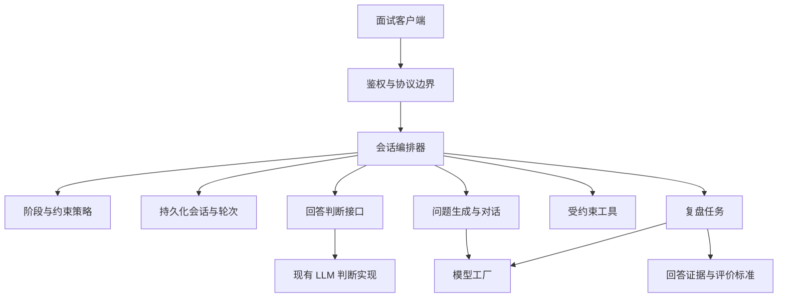

# 面试麦重构、Agent 升级与 Jev 评估方案

**文档状态：第一阶段实施中，第二、三阶段未启动。** 用户已明确启动核心流程重构，目标为可上线使用。进展与验证证据记录在[第一阶段实施记录](phase-one-progress.md)。各阶段有独立的验收门槛，完成前一阶段不代表自动启动后一阶段。

## 1. 目标与范围

按三个阶段推进：

1. **重构现有系统**：修复已确认的业务问题，打通“准备 → 候场 → 面试 → 复盘”，保留春秋招聘季主题。
2. **完善 Agent 架构**：让已有面试流程具有明确状态、可替换能力、受约束工具调用、可恢复任务及可评估行为。
3. **评估并选择性引入 Jev**：先验证复盘质量检查，再考虑回答分析与追问方向，不直接替换全部模型。

复盘是核心交付，不能等到整个 Agent 或 Jev 改造完成才做。面经广场、完整简历编辑器、投递看板等仍留在[产品待升级清单](product-backlog.md)，不顺带启动。

继续使用现有 pnpm Monorepo、Next.js、NestJS、MongoDB 和 LangGraph。先完善应用内职责划分，不拆微服务，不为未来可能的功能创建空包。

## 2. 已有基础与必须正视的问题

当前已经存在 `InterviewAgentService` 和 LangGraph 阶段节点，不是从零开始加入 Agent。已有能力包括简历编辑与文本快照、模拟面试问答、暂停/恢复接口、消费记录、报告 Schema 和 SSE。

现有基础的主要缺口：

- 进入 `/interview` 就更换整套布局；准备过程被岗位、简历、服务类型、公司/JD 和确认页面拆散。
- 语音仍为整段录制后识别，再发送文本；面试官使用浏览器朗读。它尚不是可打断的实时语音对话。
- 会话状态、扣次、模型调用、语音转换和报告编排集中在较大的 Service 中；活跃会话依赖内存 Map。
- 已复现启动入口/依赖错误、代理环境不一致、错误退款、并发兑换负余额、虚拟支付发权益、长期 OSS 凭证返回、资料字段和密码哈希返回、简历 DTO、分页/状态及 SSE 完成问题。
- 报告不存在也会触发前端反复轮询；报告任务的失败恢复和生成并发控制不足。
- 现有单元测试与 Mock 页面测试不能替代真实 Controller、MongoDB、流式响应和第三方链路验收。

开始开发时应在当时的代码基线上重新确认问题。历史审查结论不等于任何问题已经修复，也不等于其他路径全部没有问题。

## 3. 第一阶段：现有系统重构

### 3.1 先修可靠性与安全边界

| 工作 | 具体结果 | 验收重点 |
| --- | --- | --- |
| 启动与配置 | 修正构建产物入口和直接依赖；关键配置缺失时明确报错；HTTP/SSE 使用同一环境 | 标准命令构建并启动，通过健康检查；两条代理均进入目标后端 |
| 用户与简历接口 | 统一 username 契约、安全响应字段；补齐简历 DTO 校验；修复上传响应重复解包 | 修改后重新查询一致；敏感字段不出响应；删除、重命名、保存及跨用户拒绝通过 |
| 文件访问 | 使用真实限时 STS 或签名上传；限制用户目录；文档下载限定受信来源与安全跳转 | 浏览器拿不到长期密钥，用户不能访问他人上传范围；不合法下载目标被拒绝 |
| 支付入口 | 明确隔离演示与生产；生产不能用模拟成功发权益 | 未付款查询不加币；未配置真实支付时明确不可用，不能伪装成功 |
| 扣次、退款与兑换 | 条件原子扣减；记录本次扣减结果；退款幂等；余额不足时原子拒绝兑换 | 零次失败仍为零；并发余额不为负；同一操作不重复扣减或退款 |
| 订单与权益一致性 | 订单状态、权益、流水采用事务或经验证的幂等账务设计 | 发权益后流水失败等故障重试不重复入账，异常可以恢复和追踪 |
| SSE 与报告 | 缓存命中也发送结果和结束事件；统一错误与取消；报告状态明确 | 无挂起、无重复完成；不存在/失败不会无限显示生成中 |
| 历史记录 | 统一分页结构、状态枚举和总数含义 | 不同页返回对应记录；completed 正确显示完成 |

支付事务方案需要核实 MongoDB 部署是否支持事务；不支持时不能把跨文档写入称为原子事务。代码内可验证的幂等发放与恢复方案需要先确定再实现。真实支付上线还依赖沙箱与正式服务配置，本阶段不能以虚拟支付测试代替。

### 3.2 重组面试入口

- 准备页沿用网站导航与招聘季视觉，只在正式面试时收起导航、进入专注布局。
- 合并重复表单；最近岗位、简历选择和用户输入在跳转、报错后保留。
- 目标岗位为通用练习的必要信息；简历/JD 可选。无简历时明确为岗位通用练习；有简历时使用用户所属版本快照。
- 保留“提前押题”能力，但与参加模拟面试区分入口，不强迫用户理解内部 serviceType。
- 保留技术/专业能力和 HR/行为等考察类型；“热身/标准/挑战”是独立的练习强度，不能与旧 special/behavior 枚举直接混为一谈。
- 默认标准模拟。热身可以提供提示，标准和挑战集中在结束后反馈；强度、时长与阶段限制必须贯通后端，不能仅修改页面文案。
- 简历加载中、加载失败、真实空列表分开呈现；失败提供原地重试和手动经历输入。
- 候场显示实际扣次规则；设备检测不扣次，用户明确开始后再请求建立场次。

### 3.3 把现有语音能力整合进面试室

第一阶段交付稳定的**分轮语音面试**，不宣称已经支持自然双工对话。

- 录音直接在面试页面进行，移除每轮必须打开的语音弹窗。
- 默认语音，字幕始终可读；文字可随时接管，保留同一场次与已完成轮次。
- 修复 FileReader 回调未被 await、识别中状态提前结束和异步异常遗漏。
- 自然语速、播放队列有序；切换、暂停、退出时清理录音、音频上下文、监听和播放。
- 明确“提问播放、等待回答、正在收音、识别中、生成追问、暂停、连接失败”等状态。
- 保留“我说完了”按钮，不能仅凭短暂静默提交；请求重述不计为新回答。
- 权限失败、识别失败和播放失败提供重试与文字接管；失败时不丢失可恢复的回答。
- 统一语音服务接口，但第一阶段优先复用现有已配置能力。浏览器朗读若作为降级方式应如实说明；新 ASR/TTS 供应商待测试后选定。
- 生产必须验证 HTTPS、权限、音频编码与不同浏览器行为。试音不默认保存，正式录音是否留存由用户选择。

### 3.4 把复盘作为正式交付

复盘分三层，先提供实际依据，再提供结论：

1. **本场重点**：最值得保留的一点、最需要改进的两点；信息不足时明确说明。
2. **逐题回看**：问题、关联追问、回答原文、已有单题评价、亮点与缺口；新生成的评价必须引用具体回答依据。
3. **下一次怎么练**：针对缺口给出可执行练习建议，关联原题。完整报告与维度图作为补充。

新增评价保存维度标准版本、证据关联和生成状态。不能只有一个无法解释的总分；也不能将“没有提到某项信息”直接等同于“没有相关能力”。

旧记录缺少逐题评分或证据时显示“暂无该项分析”，仍可查看原问答，不自动伪造或批量重新生成。录音回放只展示确实存在且有权限的文件。复杂的单题重练、多版本比较和个人题库继续保留在 UPG-003/004，待单独启动。

### 3.5 第一阶段的代码组织

沿用现有目录，逐步抽取职责，不一次性替换全部文件：

- 前端：准备草稿、设备状态、面试会话、复盘查询分开；页面负责组合 UI，Store/Hook 管理各自状态与生命周期。
- 后端：从 `InterviewService` 抽取额度操作、会话读写、语音适配和报告任务，复用现有 AIModelFactory、解析服务与 Agent。
- 面试和报告状态分别建模；避免 URL step、本地布尔变量和数据库各自成为互相冲突的状态来源。
- 共享接口确有两端消费者后再建立 `packages/contracts`，只放无框架依赖的类型/协议；Nest DTO 运行时校验继续保留。不能为预留架构创建空目录。
- 对历史接口提供适配，先保持页面旧链接可用，再逐步移除无调用方的旧 API 封装。

### 3.6 第一阶段完成门槛

以下条件全部满足才视为主链路重构完成：

- 标准启动、普通 HTTP 与 SSE 均通过真实本地集成验证。
- 用户可以完成准备、进入、至少两轮回答、暂停/恢复、结束和复盘；拒绝麦克风后可完成同一链路。
- 同一开始请求/回答重试不重复扣次或保存两轮；后台失败不会凭空增加额度。
- 会话刷新或进程重启后有明确恢复路径，不能出现数据库有记录但页面无法继续且无处理入口。
- 报告有成功、失败、生成中、不存在四类正确行为；失败时原问答仍能查看。
- 对新生成评价能追溯回答依据；旧数据正常读取。
- 单元、接口集成、浏览器交互、lint/build 均按改动完成。真实模型和语音质量另列证据，不以 Mock 结果替代。

## 4. 第二阶段：完善现有 Agent 架构

### 4.1 目标结构

以下为计划中的职责，不表示立即创建多 Agent 进程或额外模型调用。

| 职责 | 可以决定/执行 | 不能决定/执行 |
| --- | --- | --- |
| 会话编排器 | 按状态运行下一步、持久化结果、管理取消和重试 | 绕过用户归属、直接相信模型给出的场次状态 |
| 阶段与约束策略 | 时长预算、追问上限、阶段顺序、结束条件 | 让模型无限追问或自行更改计费规则 |
| 回答判断接口 | 切题性、证据充分度、是否需要澄清、追问方向 | 把缺少信息当成事实结论，凭空生成评价证据 |
| 问题生成 | 根据岗位、履历和判断结果生成自然语言问题 | 随意改变已确定的权限与状态规则 |
| 复盘生成 | 基于问答证据生成分项反馈和改进建议 | 编造用户经历、录音指标或录取结论 |
| 工具执行边界 | 访问允许的简历快照、题目资料及受限验证工具 | 任意下载 URL、执行不受控代码、读取其他用户数据 |

不强制把这些职责都实现成独立“智能体”。确定性的步骤继续用普通代码；现有 LangGraph 负责编排需要模型参与的流程。

### 4.2 会话与轮次协议

核心数据采用持久化存储作为恢复依据，内存仅作缓存。沿用现有 resultId/sessionId 时明确映射，不能仅生成一个新 ID 就失去旧历史的关联。

- 场次：所属用户、岗位/简历/JD 快照、模式、目标时长、阶段、状态、版本、模型与提示词版本。
- 轮次：稳定 turnId、问题 ID、父追问 ID、回答原文/最终转写、提交状态、评价证据和时间信息。
- 事件：eventId、sessionId、turnId、顺序号、类型与内容，供客户端去重和断点恢复。
- 报告：独立任务状态、尝试次数、版本、错误分类和关联场次，不与面试活跃状态混用。
- 单场次并发提交使用版本检查或受约束执行，避免两次回答同时推进阶段。

首阶段至少修好实际恢复路径；第二阶段完善跨实例执行、事件续传、过期任务恢复与一致性策略。幂等通过唯一业务键和持久状态实现，不承诺网络层“恰好一次”投递。

### 4.3 任务可靠性与可观察性

- 报告任务持久化，原子领取，具备超时租约和有界重试；进程退出后可被重新领取。
- 模型失败、转写失败、存储失败和协议失败分别记录；不给失败任务填充伪成功结果。
- 每场记录生成次数、判断次数、总耗时、首段输出耗时、失败/重试、Token 和费用估算。
- 日志记录 ID、版本和状态，不默认输出完整简历、录音、密钥与 Token。
- 模型服务通过现有工厂/适配接口接入，支持按场次固定配置；回滚不让进行中的场次突然换行为。

### 4.4 实时语音作为独立升级项

在第一阶段分轮语音稳定后，再评估分段 ASR、流式 TTS、说话检测、回声处理、打断和双向音频通道。文本 SSE 可以继续承载字幕/事件；音频通道选型不能仅凭当前已有 SSE 决定。

新增语音供应商或 WebSocket/WebRTC 方案需要真实中文场景和部署网络测试。延迟改善与新增成本分别评估，不把模型响应时间当作用户听到完整回答的耗时。

### 4.5 第二阶段完成门槛

- 重复请求、过期请求、跨用户请求、并发回答均有确定处理结果。
- 刷新、掉线、进程退出和报告 Worker 中断后可恢复，不重复消费或重复发放权益。
- 已覆盖的面试阶段不倒退，超时有界结束；追问有依据，不能无限循环。
- 工具范围、输入输出、超时和权限可测试；未知工具或超范围输入被拒绝。
- 评价和对话行为有版本化样例，能定位哪次规则/模型变化导致效果变化。
- 不依赖 Jev 也可以完整运行并通过验收。

## 5. 第三阶段：Jev 评估与可选接入

### 5.1 接入边界

Jev 是回答判断接口的一种候选实现。通用 LLM 仍负责开放式问题、自然语言解释和复盘组织，代码继续负责鉴权、计费、状态转换与存储。

建议从以下顺序验证：

1. **复盘质量检查**：评价是否由问答支持、有没有把未提及的经历写成事实。
2. **回答信息检查**：是否切题、贡献是否具体、是否给出结果与验证方法。
3. **追问方向选择**：在澄清、追问依据、追问取舍、换题等允许选项中做判断。
4. **分项评分**：在评价标准和人工参考稳定后再尝试；不能直接把 Jev 输出当作客观能力总分。

先用当前 LLM 实现同一判断接口，再加入 Jev 适配器。这样可以公平对比，也可以在超时、不适用或效果不佳时回退。

### 5.2 判断结果约束

- 判断项一次只问一个明确问题；“综合评价这个人”不作为原子任务。
- 输出包含维度、判断、可用的不确定性信息、标准版本和输入证据引用。
- Jev 不生成自由文本证据；需要引用时使用上游已提取并验证的候选片段 ID，或限定为给定证据是否支持某条结论。
- 多个独立判断并行求值后，由代码组合追问策略；不能假设同批问题会自动读取彼此答案。
- confidence 反映返回概率分布，不是正确率保证；按中文业务样例选择阈值，不能照抄统一数值。
- 低把握时澄清或交给既有 LLM；未说明的信息标记为不足，不直接负向判人。

### 5.3 评估方法与上线门槛

建立固定中文样例，覆盖不同岗位、回答长度、口语、转写错漏、离题、信息不足、矛盾陈述和正常但表达方式不同的回答。用合成或授权脱敏数据，避免直接上传生产简历。

起步可以准备 100–200 条样例做探索，后续按发现的薄弱类型扩展；此数量只用于发现问题，不代表足以证明所有岗位都可靠。评价标准示例与独立留出测试集分离，人工分歧先记录和复核。

对照组至少包括当前实现、统一标准后的 LLM 实现、Jev 实现。比较：

- 判断与人工参考的一致程度，以及信息不足时的误判。
- 复盘结论没有回答依据的比例。
- 追问相关性、重复问题比例和遗漏关键澄清的情况。
- 重复测试稳定性、不同岗位/表达方式的差异。
- 整轮 P50/P95 延迟、超时率、回退率和每场总成本。

按四种模式推进：`off → shadow → pilot → enabled`。

- off：仍使用现有实现。
- shadow：Jev 在后台作判断，不改变用户追问、评分或权益。
- pilot：只在已验证场景小范围启用，保留回退。
- enabled：达到事先确定的质量、延迟和成本门槛后按场景开启。

门槛在看到候选模型测试结果前确定，避免为接入而调整标准。若质量无改善，或收益不足以抵消延迟和维护成本，结论可以是不接入。

### 5.4 参考资料

- [Jev 官方简介与任务拆分](https://docs.typesafe.ai/introduction)
- [Score 与评分等级](https://docs.typesafe.ai/primitives/score)
- [Confidence 的含义和使用](https://docs.typesafe.ai/confidence)
- [官方工作流评测](https://evals.typesafe.ai/)

上述资料说明产品能力和厂商评估，不能直接证明 Jev 在本项目中文面试场景优于现有 LLM。

## 6. 实施批次与依赖

| 批次 | 内容 | 依赖 | 交付证据 |
| --- | --- | --- | --- |
| R1 | 标准启动、配置、代理与接口基线 | 第一阶段明确启动 | 构建后启动烟测、真实 HTTP/SSE 路由检查 |
| R2 | 鉴权、文件凭证、支付及额度一致性 | R1 | 权限、并发、故障恢复测试 |
| R3 | 准备入口与接口字段/状态统一 | R1；收费/上传受 R2 约束 | 准备信息跨页保留、失败恢复及页面测试 |
| R4 | 候场、页内语音、文字接管、会话恢复 | R2、R3 | 分轮面试与拒绝权限/断线/重试测试 |
| R5 | 核心复盘、历史分页、报告任务可靠性 | R4 | 逐题证据、报告各状态和完整业务验收 |
| A1 | Agent 职责边界与持久状态完善 | 第一阶段验收 | 同一批面试样例行为对比、重启恢复 |
| A2 | 工具权限、任务执行、观测与评估体系 | A1 | 工具拒绝、任务抢占/恢复和评估报告 |
| J1 | Jev 适配与 shadow 对照 | 第二阶段验收及已确认测试服务条件 | 中文留出样例、质量/延迟/费用对比 |
| J2 | 选择性灰度及回退 | J1 达到预设门槛 | 灰度结果、回退演练与是否接入的结论 |

每批只提交对应改动，先修窄范围失败再扩大验证。这里列的是候选实施顺序，不是已派发任务、日程或交付日期。

## 7. 兼容、迁移与回滚

- 采用扩展后收缩：先增加可选字段、适配旧协议，再切换前端；确认没有旧消费者后才删除旧字段和接口。
- 历史结果保留原始 ID、时间、所属用户和已生成报告。字段缺失有读取适配，不在普通启动时隐式批量改写。
- 如需建立唯一索引，先只读检查已有重复记录，再给出可审查的处理与备份方案；不直接对生产执行。
- 新会话可记录协议和模型版本；进行中会话继续使用创建时的兼容路径，避免切换版本导致无法恢复。
- 支持关闭新界面/判断实现回到兼容路径；数据修改采用兼容写入，不能把回滚等同于删除新产生的用户数据。
- Jev 与新语音服务分别有开关，故障不影响基础文字面试、原问答查看和既有历史。

## 8. 启动相应阶段前需要确定的条件

| 条件 | 影响 | 当前处理 |
| --- | --- | --- |
| 实际模型/语音测试凭据、可用环境与费用范围 | 真实语音和模型质量验收 | 本轮不调用；先设计 Mock 与本地接口验证 |
| MongoDB 部署形态 | 支付事务、索引和故障恢复方案 | 开发相关项前核实，不默认生产支持事务 |
| 演示支付还是正式商业支付 | 支付 Provider 与验收范围 | 生产默认禁用模拟发权益；正式交易另验 |
| 录音留存方式 | 回放、存储、删除与访问控制 | 默认不新增永久留存；需留存时明确用户选择 |
| 评分标准与岗位范围 | 复盘可信度及 Jev 阈值 | 先限定样例岗位建立基线，再扩展 |

当前不需要为整份方案一次性决定全部条件；只有开始依赖这些条件的实现或真实验证时才需要落实。

## 9. 当前代码入口

- [前端布局选择](../apps/web/src/app/template.tsx)
- [面试准备页](../apps/web/src/app/interview/start/page.client.tsx)
- [面试过程](../apps/web/src/app/interview/page.client.tsx)
- [报告页面](../apps/web/src/app/interview/report/page.client.tsx)
- [面试状态 Store](../apps/web/src/stores/interviewStore.ts)
- [现有 Agent](../apps/server/src/interview/services/interview-agent.service.ts)
- [面试业务编排](../apps/server/src/interview/services/interview.service.ts)
- [持久化结果 Schema](../apps/server/src/interview/schemas/ai-interview-result.schema.ts)
- [模型工厂](../apps/server/src/ai/services/ai-model.factory.ts)

后续实现完成时同步维护对应模块的 Agent.md，尤其修正文档中与内存会话、语音能力和恢复行为不一致的描述。本方案中的目标结构不能提前写成当前已实现架构。
